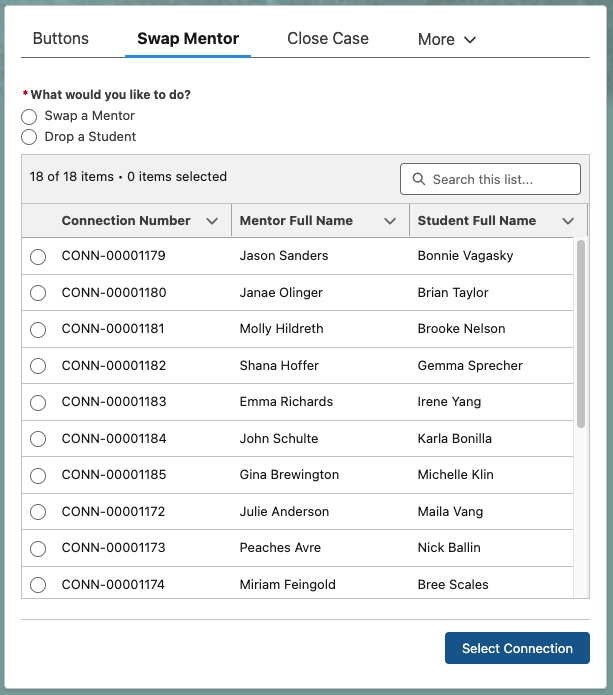
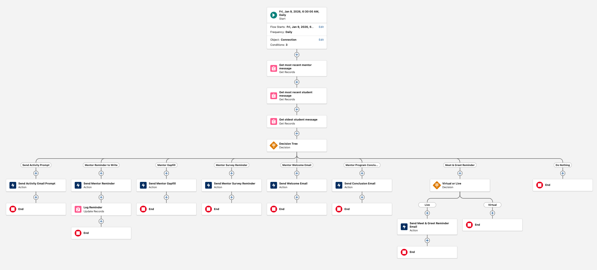

# Email Templates

Email templates have been designed using BeeFree.io and are generated as inline HTML code, sent via the Lightning Email Template system.

All scheduled eMentors Mentor emails are controlled here, daily at 6:30am: [eMentors Mentor Connection Handler](https://bestprep.lightning.force.com/lightning/r/FlowRecord/2aFRP000001BkIH2A0/view)

All scheduled Cloud Coach Mentor emails are controlled here, daily at 6:30am: [Cloud Coach Mentor Connection Handler](https://bestprep.lightning.force.com/lightning/r/FlowRecord/2aFRP000001IGIf2AO/view)

All scheduled student emails are controlled here, daily at 7:30am: [Student Connection Handler](https://bestprep.lightning.force.com/lightning/r/FlowRecord/2aFRP0000006XMH2A2/view)

## **eMentors**

| **Name** | **Trigger** | **Description**  | **Template Link**  |
| - | - | - | - |
| **Setup Emails** | | | |
| Mentoring - Class Request | Record Triggered from Flow | When a teacher submits a request for an eMentors experience, this template is sent to confirm their information | In-Progress |
| Mentoring - Class Request Edit | Record Triggered from Flow | When a teacher edits their previous request for an eMentors experience, this template is sent to confirm their changes | In-Progress |
| Mentoring - Company Request | Record Triggered from Flow | When a company coordinator submits a request for an eMentors epxerience, this template is sent to confirm their information | In-Progress | 
| Mentoring - Company Request Edit | Record Triggered from Flow | When a company coordinator edits their previous request for an eMentors experience, this template is sent to confirm their changes | In-Progress |
| Mentoring - Coordinator Handoff Notification (In-Person) | [Record Triggered from Flow](https://bestprep.lightning.force.com/lightning/r/FlowRecord/2aFRP0000003XST2A2/view) | When a coordinator is moved from the bucket to a case and the case is set to assigned, this email is sent from their BPPP | [Link to Template](https://bestprep.lightning.force.com/lightning/r/sObject/00XRP00000CTG0r2AH/view?queryScope=userFolders) |
| Mentoring - Coordinator Handoff Notification (Virtual) | [Record Triggered from Flow](https://bestprep.lightning.force.com/lightning/r/FlowRecord/2aFRP0000003XST2A2/view) | When a coordinator is moved from the bucket to a case and the case is set to assigned, this email is sent from their BPPP | [Link to Template](https://bestprep.lightning.force.com/lightning/r/sObject/00XRP00000CTFpZ2AX/view?queryScope=userFolders) |
| Mentoring - Teacher Handoff Notification (In-Person) | [Record Triggered from Flow](https://bestprep.lightning.force.com/lightning/r/FlowRecord/2aFRP0000003XST2A2/view) | When a teacher is moved from the bucket to a case and the case is set to assigned, this email is sent from their BPPP | [Link to Template](https://bestprep.lightning.force.com/lightning/r/sObject/00XRP00000CSnwX2AT/view?queryScope=userFolders) |
| Mentoring - Teacher Handoff Notification (Virtual) | [Record Triggered from Flow](https://bestprep.lightning.force.com/lightning/r/FlowRecord/2aFRP0000003XST2A2/view) | When a coordinator is moved from the bucket to a case and the case is set to assigned, this email is sent from their BPPP | [Link to Template](https://bestprep.lightning.force.com/lightning/r/sObject/00XRP00000CT6UX2A1/view?queryScope=userFolders) |
| **Scheduled Mentor Emails** |  |  |  |
| Mentor Welcome Email (eMentors) | Scheduled ([on Assigned Start Date](https://bestprep.lightning.force.com/lightning/r/FlowRecord/2aFRP000001BkIH2A0/view)) & User Triggerable for [Entire Case](https://bestprep.lightning.force.com/lightning/r/FlowRecord/2aFRP000000o8yT2AQ/view) or Single Connection | Mentor welcome email for mentors participating in eMentors connections | [Link to Template](https://bestprep.lightning.force.com/lightning/r/EmailTemplate/00XRP00000CQVfZ2AX/view?queryScope=userFolders) |
| Mentor Activity Prompt | [Scheduled on activity weeks for 6:30am from Flow](https://bestprep.lightning.force.com/lightning/r/FlowRecord/2aFRP000001BkIH2A0/view) | Reminds mentors of any virtual activity that is schedule for this week | [Link to Template](https://bestprep.lightning.force.com/lightning/r/EmailTemplate/00XRP00000CGGt72AH/view?queryScope=userFolders) |
| Mentor Reminder to Write | [Scheduled when mentor hasn't replied to student in more than 72 hours](https://bestprep.lightning.force.com/lightning/r/FlowRecord/2aFRP000001BkIH2A0/view) | An email used for both mentoring programs reminding a mentor that their message is due | [Link to Template](https://bestprep.lightning.force.com/lightning/r/EmailTemplate/00XRP00000Cdvdp2AB/view?queryScope=userFolders) |
| eMentors Mentor Gapfill | [Scheduled when student misses 2 consecutive messages & more than 72 hours past most recent assigned date](https://bestprep.lightning.force.com/lightning/r/FlowRecord/2aFRP000001BkIH2A0/view)| This notification lets a mentor know that their student hasn't had a chance to write yet and gives them an opportunity to write a message instead | [Link to Template](https://bestprep.lightning.force.com/lightning/r/EmailTemplate/00XRP00000Crg8f2AB/view) |
| Meet & Greet Reminder | [Scheduled 2 days prior to Meet & Greet](https://bestprep.lightning.force.com/lightning/r/FlowRecord/2aFRP000001BkIH2A0/view) | Reminds mentor of upcoming Meet & Greet, and to let their student know if they won't be there | [Link to Template](https://bestprep.lightning.force.com/lightning/r/EmailTemplate/00XRP00000CrfcP2AR/view?queryScope=userFolders) |
| Mentor Program Conclusion | [Scheduled for Assigned End Date](https://bestprep.lightning.force.com/lightning/r/FlowRecord/2aFRP000001BkIH2A0/view) | This email reminds the mentor to take their survey, and informs them that the program has finished. | [Link to Template](https://bestprep.lightning.force.com/lightning/r/EmailTemplate/00XRP00000CrfXZ2AZ/view) |
| Mentor Survey Reminder | [Scheduled for 3 days after Assigned End Date if survey not completed](https://bestprep.lightning.force.com/lightning/r/FlowRecord/2aFRP000001BkIH2A0/view) | Reminds mentor to take post-connection survey | [Link to Template](https://bestprep.lightning.force.com/lightning/r/EmailTemplate/00XRP00000Crfqv2AB/view?queryScope=userFolders) |
| Student Message Notification | [Triggered by a new student message being set to "Pass"](https://bestprep.lightning.force.com/lightning/r/FlowRecord/2aFRP0000005qfV2AQ/view) | Send a notification to the mentor that their student wrote a new message | [Link to Template](https://bestprep.lightning.force.com/lightning/r/EmailTemplate/00XRP00000AVhJ32AL/view?queryScope=userFolders) |
| **Triggered Mentor Emails** | | | |
| Mentor Drop Notification (To Mentor) | Trigger via [swap flow on case](https://bestprep.lightning.force.com/lightning/r/FlowRecord/2aFRP000000dt7t2AA/view) | Send to mentor to notify them that they have been dropped from the program | [Link to Template](https://bestprep.lightning.force.com/lightning/r/sObject/00XRP00000CtuvV2AR/view?queryScope=userFolders) |
| Student Drop Notification (To Mentor) | Trigger via [swap flow on case](https://bestprep.lightning.force.com/lightning/r/FlowRecord/2aFRP000000dt7t2AA/view) | Send to a mentor to notify them that their student has been dropped from the program | [Link to Template](https://bestprep.lightning.force.com/lightning/r/sObject/00XRP00000CtxdF2AR/view?queryScope=userFolders) |
| Mentor Swap Notification (To Mentor) | Trigger via [swap flow on case](https://bestprep.lightning.force.com/lightning/r/FlowRecord/2aFRP000000dt7t2AA/view) | Send to a mentor to notify them that they have a new student from a mentor who dropped | [Link to Template](https://bestprep.lightning.force.com/lightning/r/sObject/00XRP00000CtvoL2AR/view?queryScope=userFolders) |
| Mentor Portal Link | [Triggered from connection via Action Button](https://bestprep.lightning.force.com/lightning/r/FlowRecord/2aFRP000000vpQn2AI/view) | Send mentor an email with their portal link in it | [Link to Template](https://bestprep.lightning.force.com/lightning/r/EmailTemplate/00XRP00000CQSWP2A5/view?queryScope=userFolders) |
| **Student Emails** | | | |
| Student Weekly Prompt | [Scheduled from Flow weekly at 7:30am](https://bestprep.lightning.force.com/lightning/r/FlowRecord/2aFRP0000006XMH2A2/view) | Weekly prompt to students reminding them to write to their mentor | [Link to Template](https://bestprep.lightning.force.com/lightning/r/EmailTemplate/00XRP00000BRXPl2AP/view?queryScope=userFolders) |
| Student Reminder to Write | [Scheduled from connection handler](https://bestprep.lightning.force.com/lightning/r/FlowRecord/2aFRP0000006XMH2A2/view) | Reminder for a student to write if they are 3-days overdue | [Link to Template](https://bestprep.lightning.force.com/lightning/r/EmailTemplate/00XRP00000D4zbh2AB/view) |
| Mentor Drop Notification | [Triggered by drop/swap system](https://bestprep.lightning.force.com/lightning/r/FlowRecord/2aFRP000000dt7t2AA/view) | Let a student know if their mentor has dropped out of the program and they are given a new mentor | [Link to Template](https://bestprep.lightning.force.com/lightning/r/EmailTemplate/00XRP00000Ctw7h2AB/view?queryScope=userFolders) |
| Mentor Out-of-Office Notification | [Triggered by a new messsage being set to "Pass" while mentor is Out-of-Office](https://bestprep.lightning.force.com/lightning/r/FlowRecord/2aFRP0000005qfV2AQ/view) | Inform a student that their mentor is out of office if the student sends them a message during that time | [Link to Template](https://bestprep.lightning.force.com/lightning/r/EmailTemplate/00XRP00000C0RKf2AN/view?queryScope=userFolders) |
| Mentor Message Notification | [Triggered by a new mentor message being set to "Pass"](https://bestprep.lightning.force.com/lightning/r/FlowRecord/2aFRP0000005qfV2AQ/view) | Inform a student that they have gotten a message from their mentor | [Link to Template](https://bestprep.lightning.force.com/lightning/r/EmailTemplate/00XRP00000AVlUj2AL/view?queryScope=userFolders) |
| Student Portal Link | [Triggered from Action Button on Connection](https://bestprep.lightning.force.com/lightning/r/FlowRecord/2aFRP000000o8Yf2AI/view) | Used to send a student the link to their portal if they loose it | [Link to Template](https://bestprep.lightning.force.com/lightning/r/EmailTemplate/00XRP00000CQSrN2AX/view?queryScope=userFolders) |
| Student Survey Reminder | [Scheduled from Flow on Assigned End Date if survey isn't completed yet](https://bestprep.lightning.force.com/lightning/r/FlowRecord/2aFRP0000006XMH2A2/view) | Reminder for a student to complete their survey if they haven't by the assigned end date | [Link to Template](https://bestprep.lightning.force.com/lightning/r/EmailTemplate/00XRP00000D4vl02AB/view) |

## **Cloud Coach**

| **Name** | **Trigger** | **Description**  | **Template Link**  |
| - | - | - | - |
| **Setup Emails** | | | |
| Company Welcome Email | Scheduled (1 week prior to assigned start date) | Send welcome email to all company coordinators in a parent case along with their portal access link | In-Progress |
| Teacher Welcome Email | Scheduled (1 week prior to assigned start date) | Send welcome email to all teachers in a parent case along with their portal access link | In-Progress |
| Coordinator Portal Link | Triggered via Action Button | Send chosen company coordinators a reminder of what their portal link is | [Link to Template](https://bestprep.lightning.force.com/lightning/r/EmailTemplate/00XRP00000CTGWV2A5/view?queryScope=userFolders) |
| **Mentor Emails** | | | |
| Mentor Welcome Email | Scheduled (on Assigned Start Date) & User Triggerable for Entire Case or Single Connection | Email welcoming mentor to Cloud Coach | [Link to Template](https://bestprep.lightning.force.com/lightning/r/EmailTemplate/00XRP00000CzKsX2AV/view) |
| Mentor Prompt | Scheduled for 1 week prior to week assigned date | Reminds mentor to write | [Link to Template](https://bestprep.lightning.force.com/lightning/r/EmailTemplate/00XRP00000BRnXl2AL/view) |
| Mentor Gapfill Email | Sends if student hasn't written for two weeks and mentor hasn't written for one week | Sent to mentor when student hasn't replied | [Link to Template](https://bestprep.lightning.force.com/lightning/r/EmailTemplate/00XRP00000Crg8f2AB/view) |
| Mentor Reminder to Write | Scheduled to send 4 days prior to assigned date if no mentor message for that week exists yet | Reminds the mentor to write | [Link to Template](https://bestprep.lightning.force.com/lightning/r/EmailTemplate/00XRP00000CzKxO2AV/view) |
| Mentor Survey | Sends 3 days after assigned end date | Send to mentor to remind them about the survey | [Link to Template](https://bestprep.lightning.force.com/lightning/r/EmailTemplate/00XRP00000Crfqv2AB/view) |
| **Student Emails** | | | |
| Student Pre-Survey | | | In-Progress |
| Student Pre-Survey Reminder | | | In-Progress |
| Student Weekly Prompt | | | In-Progress |
| Student Gapfill | | | In-Progress |
| Student Post-Survey | | | In-Progress |

## New Connection System

A new connection can be created from a case at any time. If in a child case or eMentors case, it will create the new connection directly in that case. However, if in a Cloud Coach Parent case, it will prompt the user to choose a child case. The contacts for the connection must have already been created, but once they are created in Salesforce, the user can select them from a search box, and the system will automatically create the BestPrep Program Participation records, the connection, and send out notification emails if the current date is greater than or equal to the first message date but not yet the assigned end date. 

The user will be prompted to add any teachers and company coordinators as CC'd addresses if it is within program dates. 

| **Name** | **Trigger**  | **Template Link**  |
| - | - | - |
| Mentor Notification | [Triggered from flow](https://bestprep.lightning.force.com/lightning/r/FlowRecord/2aFRP000000xvjq2AA/view) | [Link to Template](https://bestprep.lightning.force.com/lightning/r/EmailTemplate/00XRP00000DNE2n2AH/view) | 
| Student Notification | [Triggered from Flow](https://bestprep.lightning.force.com/lightning/r/FlowRecord/2aFRP000000xvjq2AA/view) | [Link to Template](https://bestprep.lightning.force.com/lightning/r/EmailTemplate/00XRP00000DNFID2A5/view) |

## Drop & Swap System

The drop and swap system can be found on the case level view of any eMentors case or on the child-case level view of any Cloud Coach case. The tool allows a user to select an existing connection, indicate whether they want to swap the mentor or drop the student, and then allow the tool to send out all the necessary notifications. The Drop and Swap System runs from a screen flow with the api name [Mentoring_Swap_Mentor_Student](https://bestprep.lightning.force.com/lightning/r/FlowRecord/2aFRP000000dt7t2AA/view).

The drop and swap system will also allow users to choose what company coordinators and teachers they would like to be notified on the applicable notifications. 

| **Name** | **Trigger** | **Description**  | **Template Link**  |
| - | - | - | - |
| Student Drop Notification to Mentor | [Triggered from Flow](https://bestprep.lightning.force.com/lightning/r/FlowRecord/2aFRP000000dt7t2AA/view) | Notify a mentor that their student has been dropped from the program | [Link to Template](https://bestprep.lightning.force.com/lightning/r/EmailTemplate/00XRP00000CtxdF2AR/view?queryScope=userFolders) |
| Student Drop Notification | [Triggered from Flow](https://bestprep.lightning.force.com/lightning/r/FlowRecord/2aFRP000000dt7t2AA/view) | Notify a student that they have been dropped from the program | [Link to Template](https://bestprep.lightning.force.com/lightning/r/EmailTemplate/00XRP00000CtxVB2AZ/view?queryScope=userFolders) |
| Mentor Swap Notification to Student | [Triggered from Flow](https://bestprep.lightning.force.com/lightning/r/FlowRecord/2aFRP000000dt7t2AA/view) | Notification to student that they are getting a new mentor | [Link to Template](https://bestprep.lightning.force.com/lightning/r/EmailTemplate/00XRP00000Ctw7h2AB/view?queryScope=userFolders) |
| Dropped Mentor Notification | [Triggered from Flow](https://bestprep.lightning.force.com/lightning/r/FlowRecord/2aFRP000000dt7t2AA/view) | Notification to Mentor when they have been dropped from the program | [Link to Template](https://bestprep.lightning.force.com/lightning/r/EmailTemplate/00XRP00000CtuvV2AR/view?queryScope=userFolders) |
| Mentor Swap Notification | [Triggered from Flow](https://bestprep.lightning.force.com/lightning/r/FlowRecord/2aFRP000000dt7t2AA/view) | Notification to new mentor when they are taking over a connection from a dropped mentor | [Link to Template](https://bestprep.lightning.force.com/lightning/r/EmailTemplate/00XRP00000CtvoL2AR/view?queryScope=userFolders) |

{ style="display:block;margin:auto;max-width:100%;border:1px solid #ccc;border-radius:8px;box-shadow:0 0 8px rgba(0,0,0,0.1);" }

{ style="display:block;margin:auto;max-width:100%;border:1px solid #ccc;border-radius:8px;box-shadow:0 0 8px rgba(0,0,0,0.1);" }