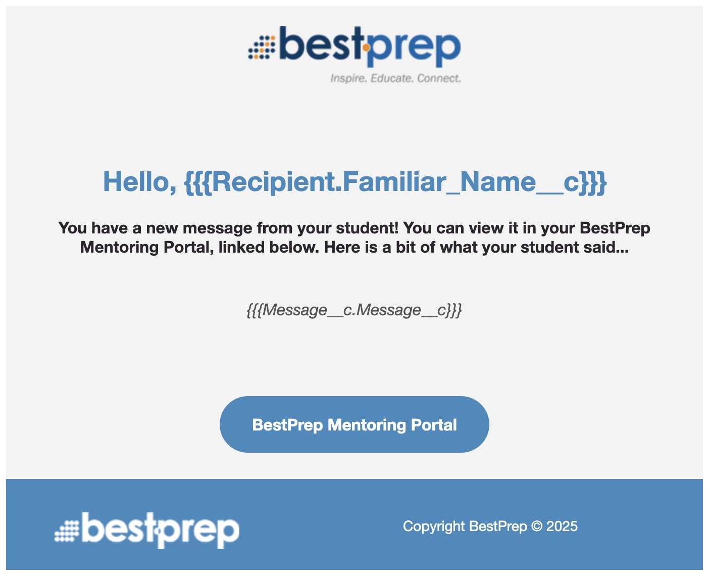

# Notification Email

Whenever a mentor or student recieves a new message, they get an email alert. This is done using two parts - a flow and a lightning email template. 

---

### [Mentoring - New Message Notification](https://bestprep.lightning.force.com/lightning/r/FlowRecord/2aFRP0000005qfV2AQ/view)

The flow [Mentoring - New Message Notification](https://bestprep.lightning.force.com/lightning/r/FlowRecord/2aFRP0000005qfV2AQ/view) is laid out in the following method.

 
graph TD
  N2[Record Triggered Flow] --> N3[Get Recipient Email]
  N3 --> N4[Decide: Mentor or Student]
  N4 -->|Mentor Wrote| N5[Send Email to Student]
  N4 -->|Student Wrote| N6[Send Email to Mentor]
  N5 --> N7[End Flow]
  N6 --> N8[End Flow]
  N2 -->|Error| N9[If An Error Happens]

  class N2 click-step-N2;
  class N3 click-step-N3;
  class N4 click-step-N4;
  class N5 click-step-N5;
  class N6 click-step-N6;
  class N9 click-step-N9;

  classDef clickable stroke:#333,stroke-width:2px;
  class N2,N3,N4,N5,N6,N9 clickable;

---

### [Lightning Email Template](https://bestprep.lightning.force.com/lightning/r/Folder/00lRP000004n9W5YAI/view?queryScope=userFolders)

There are two lightning email templates used for new message notifications, both created with the website [BeeFree.io](https://beefree.io/) and then copy and pasted into the lightning email editor after some minor changes. Both email templates are set up to relate to a Message__c record, meaning we can pull merge fields from the message record. This is done with three sets of curly brackets on each side - {{{Like This}}}

You can view all of the [Mentoring Email Templates inside this folder.](https://bestprep.lightning.force.com/lightning/r/Folder/00lRP000004n9W5YAI/view?queryScope=userFolders) 

Before being merged, the email templates look plain and broken - however, the merge fields will be filled with data later during the flow. We have three merge fields. They may look confusing or duplicate at first, but it makes sense when broken down: Record.Field. The first part is telling the email template what record to look in (the recipient or the message) and the second part is telling it what field to pull data from. So, Message__c.Message__c is saying look inside the Message record and pull the Message field. Remember, the __c just means that it is a custom object, and not something that Salesforce built into their system by default. 

- {{{Recipient.Familiar_Name__c}}}
- {{{Message__c.Mentor_Portal_Link__c}}}
- {{{Message__c.Message__c}}} 

All images in the mentoring email templates must be static direct URL type images that are publicly available to be loaded in most email clients (Outlook, Gmail, Yahoo). This means that you cannot use an image in SharePoint or Google Drive (many of our partners have these domains blocked). Best practices for our organization currently is to upload the image as an asset to WordPress and then use the wordpress image URL in the email template - usually in the format of **bestprep.org/wp-content/uploads/YYYY/MM/filename.jpg**.

You can view the notification emails below, or read about the [weekly emails here](weekly_email.md).

- [Mentoring - New Student Message](https://bestprep.lightning.force.com/lightning/r/sObject/00XRP00000AVhJ32AL/view?queryScope=userFolders)
- [Mentoring - New Mentor Message](https://bestprep.lightning.force.com/lightning/r/sObject/00XRP00000AVlUj2AL/view?queryScope=userFolders)

  

    &times;
    <h2>Record Triggered Flow</h2>
    
When the record is triggered, it works like this: Whenever the object Message__c is updated TO meet the condition from previously not having met the condition, execute the following flow.   The condition in this case is whenever Filter_Status__c is changed from being anything else to "Pass" - then execute this flow.  This ensures that no one gets a message that was still flagged or being reviewed. Additionally, it only runs AFTER the record has been saved, to avoid any accidental mis-clicks.

  

  

    &times;
    <h2>Get Connection Data</h2>
    
Once the record has been triggered, our first action is to get the data of the connection that owns the message which was just passed.  We do this by finding the Record ID of the connection that owns the message, and then pulling all the data from the connection that has a matching Record ID.  We then sort by most recent and only return the first. This shouldn't ever actually be neccesary but is best practice to include.

  

  

    &times;
    <h2>Mentor or Student</h2>
    
We use a simple logic statement to decide if the message was from a mentor or a student.  If the message was from a mentor, we continue down the "Send Email to Student" path. If the message was from a student, we continue down the "Send Email to Mentor" path.  This is checked using Role__c of the triggering Message__c record.

  

  

    &times;
    <h2>Send Email to Student</h2>
    
In this step, we have already decided that a mentor wrote a message, and we want to alert the student. We fill in a few fields in our action that allows us to do this.  We send from an organization wide email address (currently ementors@bestprep.org) which has been configured in settings.  We use our email template created for this step (Mentoring - New Mentor Message) and also put in both our related record ID and recipient record.   The related record is a Message__c object (setup in the lightning email template) and we use the triggering Message__c record. Our recipient is a little more complicated, as this always must be a contact or a lead record - so we go through the Message__c to the Connection__c, then into the student BestPrep_Program_Participation__c, and finally into the Contact where we get Contact Id. This is the recipient record that we will use.

  

  

    &times;
    <h2>Send Email to Mentor</h2>
    
In this step, we have already decided that a student wrote a message, and we want to alert the mentor. We fill in a few fields in our action that allows us to do this.  We send from an organization wide email address (currently ementors@bestprep.org) which has been configured in settings.  We use our email template created for this step (Mentoring - New Student Message) and also put in both our related record ID and recipient record.   The related record is a Message__c object (setup in the lightning email template) and we use the triggering Message__c record. Our recipient is a little more complicated, as this always must be a contact or a lead record - so we go through the Message__c to the Connection__c, then into the mentor BestPrep_Program_Participation__c, and finally into the Contact where we get Contact Id. This is the recipient record that we will use.

  

  

    &times;
    <h2>Uh-oh... there was an error.</h2>
    
If for any reason an error should occur, Salesforce will not allow any user to pass a message while the error is happening.

  

