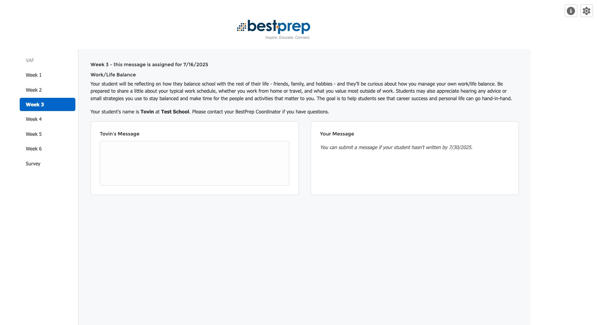
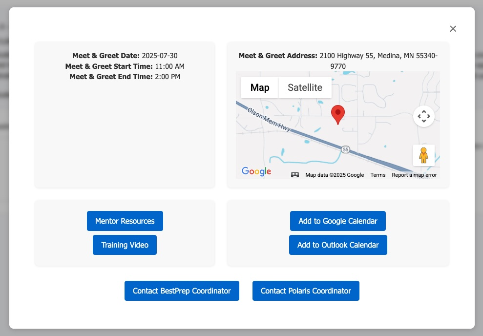
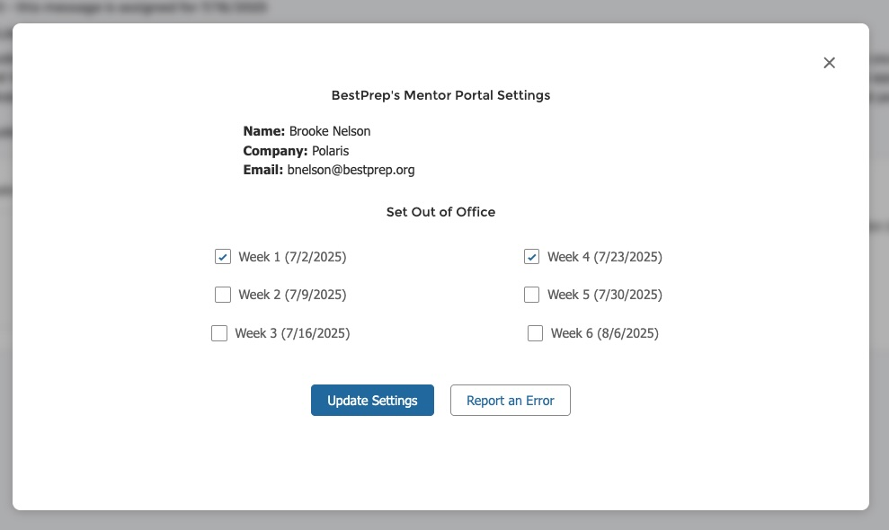

# BestPrep's Mentor Portal

The mentor portal (built by Tovin Sannes-Venhuizen, 2025) has become the new home for all of BestPrep's Mentor Tools. While it packs a lot of functionality, it has a few different components under the hood that allow it to function properly. 

- [Apex Code](mentor_apex.md)
- [JavaScript](mentor_js.md)
- [HTML & CSS](mentor_web.md)

### Screenshots

{ style="display:block;margin:auto;max-width:100%;border:1px solid #ccc;border-radius:8px;box-shadow:0 0 8px rgba(0,0,0,0.1);" }

The portal comes complete with info and settings modals, to help the mentor have the best possible experience. 

### Mentor Info Modal
{ style="display:block;margin:auto;max-width:100%;border:1px solid #ccc;border-radius:8px;box-shadow:0 0 8px rgba(0,0,0,0.1);" }

### Mentor Settings Modal
{ style="display:block;margin:auto;max-width:100%;border:1px solid #ccc;border-radius:8px;box-shadow:0 0 8px rgba(0,0,0,0.1);" }

