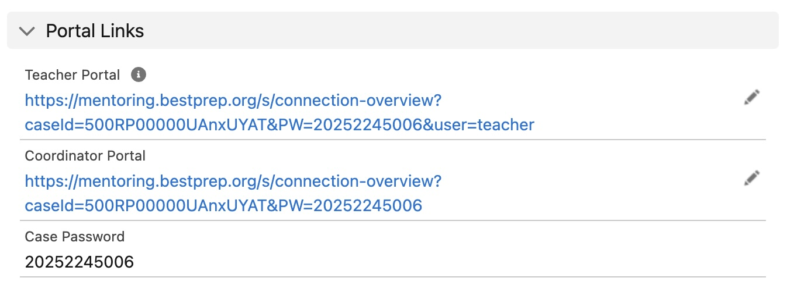

# Other Flows

In addition to those that can be easily classified into either the flagging system or the email system, there are a few other pieces that make up the mentoring system. 

---

### [Mentoring - Update Teacher Portal URL](https://bestprep.lightning.force.com/lightning/r/FlowRecord/2aFRP000000547p2AA/view)

The flow [Mentoring - Update Teacher Portal URL](https://bestprep.lightning.force.com/lightning/r/FlowRecord/2aFRP000000547p2AA/view) is designed to populate the portal section on eMentors and Cloud Coach cases. The only true difference in the URL for teacher versus coordinator portal links is the addition of <code>&user=teacher</code> on the end. In fact, if that tag is anything other than <code>teacher</code> it will display the coordinator portal. <a class="click-step-why">You can learn more about why here.</a>

 
graph TD
  N2[Record-Triggered Flow] --> N3[Get Triggering Case Records]
  N3 --> N4[Create Coordinator Link]
  N4 --> N5[Update Coordinator Link]
  N5 --> N6[Create Teacher Link]
  N6 --> N7[Update Teacher Link]
  N7 --> N8[End]
  
  N2 -->|Error| N9[If An Error Happens]

  class N2 click-step-N2;
  class N3 click-step-N3;
  class N4 click-step-N4;
  class N5 click-step-N5;
  class N6 click-step-N6;
  class N7 click-step-N7;
  class N9 click-step-N9;

  classDef clickable stroke:#333,stroke-width:2px;
  class N2,N3,N4,N5,N6,N7,N9 clickable;

---

  

    &times;
    <h2>Why <code>&user=teacher</code></h2>
    
It was an intentional decision to use <code>&user=teacher</code> for the teacher portal, but not to use <code>&user=coodinator</code> or <code>&user=company</code> for the company coordinator portal.  The main difference lies in that teachers have access to student messages, and they should be the only ones who do. While it isn't necessarily "protected information" it also isn't information that just anyone should be allowed to have.  If a coordinator, or any other related party, recieved a link that ended in <code>&user=coordinator</code>, it wouldn't be that difficult to realize that simply changing the user tag could change the view. The decision was made in line with our best practices to try and protect student data to a reasonable extent.

  

  

    &times;
    <h2>Record-Triggered Flow</h2>
    
This flow will trigger whenever a case is created OR updated and the RecordTypeId equals either eMentors (012A0000000z1RhIAI) or Cloud Coach (TBD).

  

  

    &times;
    <h2>Get Triggering Case Records</h2>
    
Get the case where <code>CaseId</code> equals that of the triggering case.

  

  

    &times;
    <h2>Create Coordinator Link</h2>
    
Using the case record that triggered the flow, create the coordinator link by adding each piece of the link to a variable that can then be easily changed:

    <ul>
      <li>Add <code>https://mentoring.bestprep.org/s/connection-overview?caseId=</code> to variable <code>URL</code></li>
      <li>Add <code>CaseId</code> of the triggering case to variable <code>URL</code></li>
      <li>Add <code>&PW=</code> to variable <code>URL</code></li>
      <li>Add <code>Case_Password__c</code> to variable <code>URL</code></li>
    </ul>
  

  

    &times;
    <h2>Update Coordinator Link</h2>
    
Take the variable <code>URL</code> and update field <code>Coordinator_Portal_URL__c</code> on the triggering case.

  

  

    &times;
    <h2>Create Teacher Link</h2>
    
Using the case record that triggered the flow, create the teacher link by adding each piece of the link to a variable that can then be easily changed:

    <ul>
      <li>Add <code>https://mentoring.bestprep.org/s/connection-overview?caseId=</code> to variable <code>URL</code></li>
      <li>Add <code>CaseId</code> of the triggering case to variable <code>URL</code></li>
      <li>Add <code>&PW=</code> to variable <code>URL</code></li>
      <li>Add <code>Case_Password__c</code> to variable <code>URL</code></li>
      <li>Add <code>&user=teacher</code> to variable <code>URL</code></li>
    </ul>
  

  

    &times;
    <h2>Update Teacher Link</h2>
    
Take the variable <code>URL</code> and update field <code>Teacher_Portal_URL__c</code> on the triggering case.

  

  

    &times;
    <h2>Uh-oh... there was an error.</h2>
    
If for any reason an error should occur, Salesforce will not allow any user to save a case while the error is happening.

  

