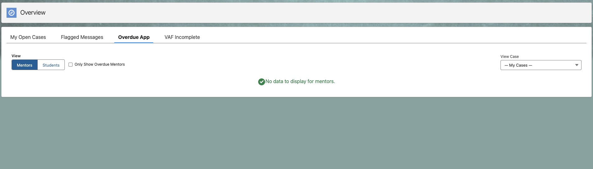
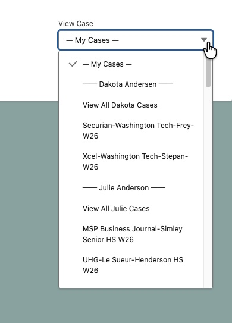
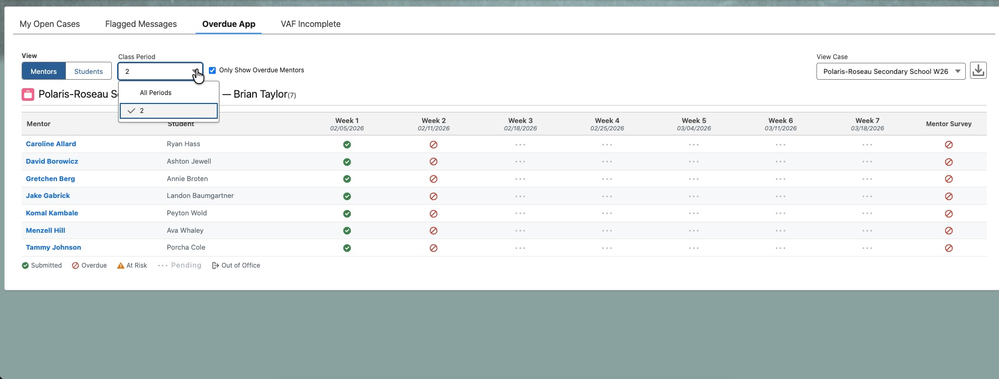
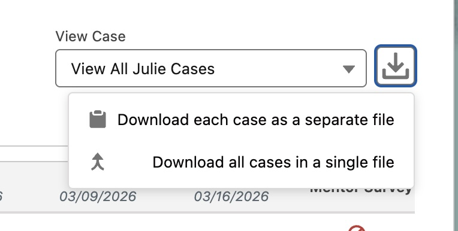
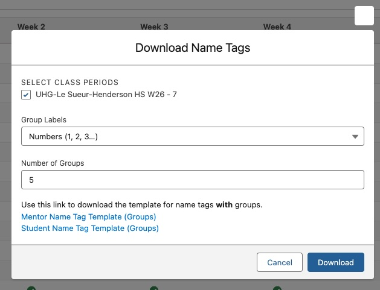

# Mentoring Overdue App

The Overdue App is the BestPrep way to monitor our mentoring connections within Salesforce — to see what mentors and students have written, completed their surveys, or may be overdue on messages. The app can be found in the **Overview** tab, which you can search for via the 9 dots in the upper left corner of the screen.

By default, the app will attempt to load any open cases that you own which have the record type of either eMentors or Cloud Coach. If none exist, you will be met with an empty screen. This is the same screen you will see if you have an active case but no connection objects have yet been created.



If you would like to view a specific case that might not belong to you, you can do so using the selection dropdown on the right-hand side of the app. Cases in the dropdown are grouped by case owner. You can choose to view all cases for a specific staff member at once using the **View All [Name] Cases** option, or select a single specific case.



Once you have selected a case, the view will populate. You have the option to choose from two different overall views — either **Mentors** or **Students** — using the toggle buttons in the upper left. You can then further narrow what you see using the **Class Period** filter or the **Only Show Overdue** checkbox. Any changes you make to the on-screen filters will also apply to the file downloaded using the download feature.




Each case is displayed as its own table, with the header showing the **Case Subject** and the **Case Owner's name**. The row count shown next to the case title reflects the number of connections currently visible given your active filters.

---

## The Status Grid

Each row in the table represents one mentor-student connection. The columns are as follows:

- **Primary name column** — the name of the person whose view you are in (Mentor or Student), shown in bold and linked to the connection record in Salesforce
- **Secondary name column** — the paired person's name, shown in grey
- **Week columns** — one column per program week, labeled **Week 1**, **Week 2**, etc., with the due date shown in smaller italic text beneath the label
- **Survey column(s)** — one or two checkbox columns at the end depending on the view (see below)

Each week cell displays one of four icons:

| Icon | Meaning |
|------|---------|
| ✅ Green check | The message was submitted. Hovering shows the submission date. |
| ❌ Red X | The message is overdue. Clicking opens a pre-filled email to the mentor or student. |
| ⚠️ Yellow warning | The message is at risk — it is due soon but has not yet been written. Clicking opens a pre-filled reminder email. |
| ••• Grey dots | The week is not yet due. No action needed. |
| 🔘 Out of Office Symbol | The mentor is marked as Out of Office for this week (see below). |

---

## Mentor View

The Mentor view shows one row per connection, with the **mentor** as the primary (bold) name and the **student** as the secondary (grey) name.

For **Cloud Coach** cases, a mentor is considered overdue as soon as the week date has passed and they have not written their message. They are considered **at risk** if the due date is within 4 days and no message has been written yet.

For **eMentors** cases, a mentor is considered overdue if their student has written a message and the mentor has not replied within 3 days.

At the end of each row there is a **Mentor Survey** column showing whether the mentor has completed their end-of-program survey (green check = complete, red X = incomplete).

---

## Student View

The Student view shows one row per connection, with the **student** as the primary (bold) name and the **mentor** as the secondary (grey) name.

A student is considered overdue if they have not written their week's message more than 3 days after the week date.

For **Cloud Coach** cases, there are two survey columns at the end of each row:

- **Pre-Survey** — whether the student completed the pre-program survey
- **Survey** — whether the student completed the end-of-program survey

For **eMentors** cases, only the **Survey** column is shown.

---

## Only Show Overdue Filter

The **Only Show Overdue** checkbox (located in the top controls bar, next to the Class Period filter) limits the table to connections that currently require attention. The logic differs slightly by program type and view:

**Mentor view — Cloud Coach:** Shows mentors who have not written the most recent due week's message, and are either past the due date or within 4 days of it.

**Mentor view — eMentors:** Shows mentors who have not replied to their student's most recent message within 3 days.

**Student view (all types):** Shows students who have not written the most recent due week's message and are more than 3 days past that week's due date.

> **Important:** Only the *most recent active week* is evaluated. A mentor or student who missed an earlier week but is current on the latest week will **not** appear in the overdue filter.

---

## Out of Office

If a mentor has been marked as **Out of Office** for a given week (set on the connection record in Salesforce), their week cell will display a grey out of office icon rather than a red X or yellow warning, and they will **not** be included in the overdue filter for that week.

The one exception is the **previous week fallback rule**: if a mentor is out of office for the current week *and* also missed the previous week without being out of office for it, they will still appear in the overdue filter. This ensures that a sustained pattern of missed messages is not hidden by an out-of-office designation.

---

## Emailing Mentors and Students

Clicking a **red X** (overdue) or **yellow warning** (at risk) icon opens your default email client with a pre-filled message addressed to the mentor or student. The email includes:

- A personalized greeting using the mentor's or student's familiar name
- Context about which week is missing
- A direct link to their mentoring portal
- Your first name as the sign-off

If you are viewing a case that belongs to another staff member (i.e., you used the dropdown to load someone else's case), the case owner will automatically be **CC'd** on any email you send from within the app.

---

## Downloading Data



Clicking the **download icon** (top right of the app, only visible when data is loaded) opens a menu with three options:

1. **Download each case as a separate file** — exports one CSV per case currently on screen
2. **Download all cases in a single file** — exports one combined CSV with an additional Case Subject column
3. **Download name tags** — opens a configuration dialog to generate name badge CSVs with optional grouping (see below)

### CSV Downloads

The first two options export the connections currently visible on screen — if you have the **Only Show Overdue** filter active or a **Class Period** filter applied, only those rows will be exported. This makes the download immediately ready for tasks such as a mail merge in Outlook to all overdue mentors.

The filename follows the format:

```
CaseSubject_OverdueMentors.csv
CaseSubject_OverdueStudents.csv
AllCases_OverdueMentors.csv
AllCases_OverdueStudents.csv
```

Depending on the active view, the columns in the exported file differ:

**Mentor CSV:**

| Mentor Full Name | Mentor Familiar Name | Mentor Email | Mentor Organization | Week 1 Date | Week 2 Date | … | Mentor Survey Complete | Mentor Portal Link |
| | | | | | | | | | 

**Student CSV (Cloud Coach):**

| Student Full Name | Student Familiar Name | Student Email | Student Pre-Survey Complete | Week 1 Date | Week 2 Date | … | Survey Complete | Student Portal Link |
| | | | | | | | | | 

**Student CSV (eMentors):**

| Student Full Name | Student Familiar Name | Student Email | Week 1 Date | Week 2 Date | … | Survey Complete | Student Portal Link |
| | | | | | | | |

If you download a combined file, it will also include a column for case subject. 

Week date columns are labeled with the week name and date (e.g. `Week 1 (01/16/2026)`). A date value is only filled in for weeks where the message has been submitted; overdue or pending weeks are left blank.


---

### Downloading Name Tags

The **Download name tags** option is designed to help prepare name badges for in-person mentoring events. When selected, a dialog opens where you can configure the following:

**Select Class Periods** — A list of checkboxes showing every Case–Class Period combination from the currently loaded data (e.g., "Fall 2026 Lincoln High - Period 1", "Fall 2026 Lincoln High - Period 2"). All are selected by default. Check or uncheck to choose which class periods to include.

**Group Labels** — Choose how you would like connections to be divided into groups:

| Option | Labels Used |
|--------|-------------|
| No Groups | No group column is included in the output |
| Letters | A, B, C, D, E, F, G, H, I, J |
| Numbers | 1, 2, 3, 4, 5, 6, 7, 8, 9, 10 |
| Colors | Red, Green, Blue, Yellow, Purple, Orange, Pink, Beige, Lilac, Grey |

**Number of Groups** — If a group type other than "No Groups" is selected, you can specify how many groups to create (1–10). Connections are distributed evenly across groups using round-robin assignment.



Once configured, clicking **Download** generates two CSV files:

**NameTags-Mentors.csv** — One row per mentor. Mentors are identified by their email address, so if the same mentor appears in multiple connections across the selected class periods, they are combined into a single row. If a mentor has two students, the second student is placed in the Student Two columns.

| Column | Description |
|--------|-------------|
| Group | Group label (omitted if "No Groups" is selected) |
| MFN | Mentor first name |
| MLN | Mentor last name |
| S1FN | Student one first name |
| S1LN | Student one last name |
| S2 | Shows "Student:" if the mentor has a second student, otherwise blank |
| S2FN | Student two first name |
| S2LN | Student two last name |

**NameTags-Students.csv** — One row per student. Each student appears individually (even if their mentor has two students), and inherits the same group as their mentor so that mentor-student pairs are always in the same group.

| Column | Description |
|--------|-------------|
| Group | Group label (omitted if "No Groups" is selected) |
| SFN | Student first name |
| SLN | Student last name |
| MFN | Mentor first name |
| MLN | Mentor last name |

Both files are sorted alphabetically by last name. The mentor file sorts by mentor last name; the student file sorts by student last name.

You can download the merge templates here:
- [Mentor Name Badges (With Group)](../../images/mentoring/overdue_app/Mentor%20Name%20Badges%20(With%20Group).docx)
- [Mentor Name Badges (Without Group)](../../images/mentoring/overdue_app/Mentor%20Name%20Badges%20(Without%20Group).docx)
- [Student Name Badges (With Group)](../../images/mentoring/overdue_app/Student%20Name%20Badges%20(With%20Group).docx)
- [Student Name Badges (Without Group)](../../images/mentoring/overdue_app/Student%20Name%20Badges%20(Without%20Group).docx)

---

## Features Summary

- **Mentor and Student views** — toggle between the two perspectives using the button group in the top left
- **Class Period filter** — narrow the table to a single class period when a case has multiple periods
- **Only Show Overdue** — hide connections that are current and only surface those needing follow-up
- **Out of Office awareness** — mentors marked OOO for a week are shown with a grey icon and excluded from the overdue filter, unless they also missed the prior week without being OOO
- **Click-to-email** — red and yellow icons are clickable links that open a pre-addressed, pre-filled email in your default mail client; case owner is auto-CC'd if you are not the owner
- **Survey status columns** — at-a-glance checkboxes for mentor survey completion (mentor view) and student pre-survey and survey completion (student view)
- **Case owner grouping** — the dropdown groups cases by staff member, with a "View All" option per person
- **CSV download** — exports exactly what is on screen, with the option of either one file per case or combined, in a format ready for mail merge or reporting
- **Name tag download** — generates two CSV files (one for mentors, one for students) with configurable grouping for name badge preparation at in-person events; mentors with two students are combined into a single row, and students always share their mentor's group
- **Case header** — every table is labeled with both the case subject and the case owner's name so context is always clear when viewing multiple cases at once

## Code

Code for reference in the event it is no longer available on Salesforce. 

**Apex**
```sql
public with sharing class MentoringOverdueController {

    public class CaseWrapper {
        @AuraEnabled public Id caseId;
        @AuraEnabled public String subject;
        @AuraEnabled public Date assignedStart;
        @AuraEnabled public Date assignedEnd;
        @AuraEnabled public List<WeekDate> ccDates;
        @AuraEnabled public List<ConnectionWrapper> connections;
        @AuraEnabled public Boolean isParentCase;
        @AuraEnabled public String ownerFirstName;
        @AuraEnabled public String ownerLastName;
        @AuraEnabled public String ownerEmail;
        @AuraEnabled public Id ownerId;
    }

    public class WeekDate {
        @AuraEnabled public String week;
        @AuraEnabled public Date weekDate;

        public WeekDate(String w, Date d) {
            this.week = w;
            this.weekDate = d;
        }
    }

    public class ConnectionWrapper {
        @AuraEnabled public Id connectionId;
        @AuraEnabled public String mentorName;
        @AuraEnabled public String mentorFamiliarName;
        @AuraEnabled public String mentorEmail;
        @AuraEnabled public String studentName;
        @AuraEnabled public String studentFamiliarName;
        @AuraEnabled public String studentEmail;
        @AuraEnabled public String classPeriod;
        @AuraEnabled public String organization;
        @AuraEnabled public String connectionType;
        @AuraEnabled public String connectionPasskey;
        @AuraEnabled public Boolean mentorSurveyCompleted;
        @AuraEnabled public Boolean studentPreSurveyCompleted;
        @AuraEnabled public Boolean studentSurveyCompleted;
        @AuraEnabled public String mentorOutOfOffice;
        @AuraEnabled public List<MessageWrapper> messages;
    }

    public class MessageWrapper {
        @AuraEnabled public DateTime createdDate;
        @AuraEnabled public String role;
        @AuraEnabled public String week;
    }

    public class CaseOption {
        @AuraEnabled public Id caseId;
        @AuraEnabled public String subject;
        @AuraEnabled public Id ownerId;
        @AuraEnabled public String ownerFirstName;
        @AuraEnabled public String ownerLastName;
    }

    /**
     * Returns the running user's first name for use in email templates.
     */
    @AuraEnabled(cacheable=true)
    public static String getCurrentUserFirstName() {
        return UserInfo.getFirstName();
    }

    /**
     * Returns the running user's Id.
     */
    @AuraEnabled(cacheable=true)
    public static Id getCurrentUserId() {
        return UserInfo.getUserId();
    }

    /**
     * Returns the current user's owned cases that are active/assigned today.
     */
    @AuraEnabled(cacheable=true)
    public static List<CaseWrapper> getCasesWithConnectionsAndMessages() {
        Date today = Date.today();

        List<Case> cases = [
            SELECT Id, Subject, Status,
                   Assigned_Start_Date__c, Assigned_End_Date__c,
                   Is_Parent_Case__c,
                   OwnerId,
                   Owner.FirstName, Owner.LastName, Owner.Email,
                   CC_Date_1__c, CC_Date_2__c, CC_Date_3__c, CC_Date_4__c,
                   CC_Date_5__c, CC_Date_6__c, CC_Date_7__c, CC_Date_8__c,
                   (SELECT Id, Deactivate__c, Mentor_Full_Name__c, Mentor_Familiar_Name__c, Mentor_Email__c,
                           Student_Full_Name__c, Student_Familiar_Name__c, Student_Email__c,
                           Class_Period__c, Mentor_Organization_Proper__c, Connection_Type__c,
                           Connection_Passkey__c,
                           Mentor_Survey_Completed__c,
                           Student_PreSurvey_Completed__c,
                           Student_Survey_Completed__c,
                           Mentor_Out_of_Office__c,
                           (SELECT CreatedDate, Role__c, Week__c FROM Messages__r)
                    FROM Connections__r
                    WHERE Deactivate__c = FALSE)
            FROM Case
            WHERE OwnerId = :UserInfo.getUserId()
              AND Status = 'Assigned'
              AND Assigned_Start_Date__c <= :today
              AND Assigned_End_Date__c >= :today
        ];

        return buildWrappers(cases);
    }

    /**
     * Returns a lightweight list of ALL currently-assigned eMentors / Cloud Coach cases
     * grouped by owner — used to populate the "browse other cases" dropdown.
     */
    @AuraEnabled(cacheable=true)
    public static List<CaseOption> getAssignedCaseOptions() {
        Date today = Date.today();

        List<Case> cases = [
            SELECT Id, Subject, OwnerId, Owner.FirstName, Owner.LastName, Is_Parent_Case__c, RecordType.Name
            FROM Case
            WHERE Status = 'Assigned'
              AND Assigned_Start_Date__c <= :today
              AND Assigned_End_Date__c >= :today
              AND RecordType.Name IN ('Cloud Coach', 'eMentors')
              AND (RecordType.Name = 'eMentors' OR Is_Parent_Case__c = FALSE OR Is_Parent_Case__c = NULL)
            ORDER BY Owner.LastName ASC, Owner.FirstName ASC, Subject ASC
        ];

        List<CaseOption> options = new List<CaseOption>();
        for (Case c : cases) {
            CaseOption opt = new CaseOption();
            opt.caseId         = c.Id;
            opt.subject        = c.Subject;
            opt.ownerId        = c.OwnerId;
            opt.ownerFirstName = c.Owner.FirstName;
            opt.ownerLastName  = c.Owner.LastName;
            options.add(opt);
        }
        return options;
    }

    /**
     * Loads full case data (connections + messages) for a single case by Id.
     */
    @AuraEnabled(cacheable=true)
    public static CaseWrapper getCaseDataById(Id caseId) {
        List<Case> cases = [
            SELECT Id, Subject, Status,
                   Assigned_Start_Date__c, Assigned_End_Date__c,
                   Is_Parent_Case__c,
                   OwnerId,
                   Owner.FirstName, Owner.LastName, Owner.Email,
                   CC_Date_1__c, CC_Date_2__c, CC_Date_3__c, CC_Date_4__c,
                   CC_Date_5__c, CC_Date_6__c, CC_Date_7__c, CC_Date_8__c,
                   (SELECT Id, Deactivate__c, Mentor_Full_Name__c, Mentor_Familiar_Name__c, Mentor_Email__c,
                           Student_Full_Name__c, Student_Familiar_Name__c, Student_Email__c,
                           Class_Period__c, Mentor_Organization_Proper__c, Connection_Type__c,
                           Connection_Passkey__c,
                           Mentor_Survey_Completed__c,
                           Student_PreSurvey_Completed__c,
                           Student_Survey_Completed__c,
                           Mentor_Out_of_Office__c,
                           (SELECT CreatedDate, Role__c, Week__c FROM Messages__r)
                    FROM Connections__r
                    WHERE Deactivate__c = FALSE)
            FROM Case
            WHERE Id = :caseId
            LIMIT 1
        ];

        if (cases.isEmpty()) return null;
        List<CaseWrapper> wrapped = buildWrappers(cases);
        return wrapped[0];
    }

    // ─── Private helpers ────────────────────────────────────────────────────

    private static List<CaseWrapper> buildWrappers(List<Case> cases) {
        List<CaseWrapper> result = new List<CaseWrapper>();

        for (Case c : cases) {
            CaseWrapper cw = new CaseWrapper();
            cw.caseId       = c.Id;
            cw.subject      = c.Subject;
            cw.assignedStart = c.Assigned_Start_Date__c;
            cw.assignedEnd   = c.Assigned_End_Date__c;
            cw.isParentCase  = c.Is_Parent_Case__c;
            cw.ownerId       = c.OwnerId;
            cw.ownerFirstName = c.Owner.FirstName;
            cw.ownerLastName  = c.Owner.LastName;
            cw.ownerEmail     = c.Owner.Email;

            cw.ccDates = new List<WeekDate>();
            if (c.CC_Date_1__c != null) cw.ccDates.add(new WeekDate('Week 1', c.CC_Date_1__c));
            if (c.CC_Date_2__c != null) cw.ccDates.add(new WeekDate('Week 2', c.CC_Date_2__c));
            if (c.CC_Date_3__c != null) cw.ccDates.add(new WeekDate('Week 3', c.CC_Date_3__c));
            if (c.CC_Date_4__c != null) cw.ccDates.add(new WeekDate('Week 4', c.CC_Date_4__c));
            if (c.CC_Date_5__c != null) cw.ccDates.add(new WeekDate('Week 5', c.CC_Date_5__c));
            if (c.CC_Date_6__c != null) cw.ccDates.add(new WeekDate('Week 6', c.CC_Date_6__c));
            if (c.CC_Date_7__c != null) cw.ccDates.add(new WeekDate('Week 7', c.CC_Date_7__c));
            if (c.CC_Date_8__c != null) cw.ccDates.add(new WeekDate('Week 8', c.CC_Date_8__c));

            cw.connections = new List<ConnectionWrapper>();

            for (Connection__c conn : c.Connections__r) {
                if (conn.Connection_Type__c != 'eMentors' && conn.Connection_Type__c != 'Cloud Coach') {
                    continue;
                }

                ConnectionWrapper conWrap = new ConnectionWrapper();
                conWrap.connectionId          = conn.Id;
                conWrap.mentorName            = conn.Mentor_Full_Name__c;
                conWrap.mentorFamiliarName     = conn.Mentor_Familiar_Name__c;
                conWrap.mentorEmail           = conn.Mentor_Email__c;
                conWrap.studentName           = conn.Student_Full_Name__c;
                conWrap.studentFamiliarName   = conn.Student_Familiar_Name__c;
                conWrap.studentEmail          = conn.Student_Email__c;
                conWrap.classPeriod           = conn.Class_Period__c;
                conWrap.organization          = conn.Mentor_Organization_Proper__c;
                conWrap.connectionType        = conn.Connection_Type__c;
                conWrap.connectionPasskey     = conn.Connection_Passkey__c;
                conWrap.mentorSurveyCompleted       = conn.Mentor_Survey_Completed__c;
                conWrap.studentPreSurveyCompleted   = conn.Student_PreSurvey_Completed__c;
                conWrap.studentSurveyCompleted      = conn.Student_Survey_Completed__c;
                conWrap.mentorOutOfOffice           = conn.Mentor_Out_of_Office__c;
                conWrap.messages              = new List<MessageWrapper>();

                for (Message__c msg : conn.Messages__r) {
                    MessageWrapper mw = new MessageWrapper();
                    mw.createdDate = msg.CreatedDate;
                    mw.role        = msg.Role__c;
                    mw.week        = msg.Week__c;
                    conWrap.messages.add(mw);
                }

                cw.connections.add(conWrap);
            }

            result.add(cw);
        }

        return result;
    }
}
```

**HTML**
```html
<template>
    <lightning-card>
        <div class="slds-m-around_medium">

            <!-- ── Top Controls Bar ──────────────────────────────────────────── -->
            <div class="controls slds-grid slds-wrap slds-grid_align-spread slds-grid_vertical-align-center slds-m-bottom_small">

                <!-- Left: View toggle + Class Period filter + Only Overdue checkbox -->
                <div class="slds-grid slds-wrap slds-grid_vertical-align-center" style="gap: 0.75rem;">
                    <lightning-radio-group
                        name="viewOptions"
                        label="View"
                        options={viewOptions}
                        value={overdueView}
                        onchange={handleViewChange}
                        type="button">
                    </lightning-radio-group>

                    <template if:true={hasClassPeriods}>
                        <lightning-combobox
                            name="classPeriod"
                            label="Class Period"
                            value={selectedClassPeriod}
                            placeholder="All Periods"
                            options={classPeriodOptions}
                            onchange={handleClassPeriodChange}
                            style="min-width: 160px;">
                        </lightning-combobox>
                    </template>

                    <!-- Only Show Overdue checkbox -->
                    <div class="slds-form-element" style="padding-top: 1.5rem;">
                        <label class="slds-checkbox__label" style="display:inline-flex;align-items:center;gap:0.4rem;cursor:pointer;">
                            <input type="checkbox" checked={showOnlyOverdue} onchange={handleOnlyOverdueChange} />
                            <span class="slds-text-body_small">{onlyOverdueLabel}</span>
                        </label>
                    </div>
                </div>

                <!-- Right: Case dropdown + Download -->
                <div class="slds-grid slds-grid_vertical-align-end" style="gap: 0.5rem;">
                    <template if:true={hasCaseOptions}>
                        <lightning-combobox
                            name="caseSelect"
                            label="View Case"
                            value={selectedCaseId}
                            placeholder="Select a case…"
                            options={caseSelectOptions}
                            onchange={handleCaseSelect}
                            style="min-width: 260px;">
                        </lightning-combobox>
                    </template>

                    <!-- Download dropdown -->
                    <template if:true={hasDisplayData}>
                        <div class="download-dropdown-wrap" style="padding-bottom: 2px; position: relative;">
                            <button
                                class="slds-button slds-button_icon slds-button_icon-border-filled"
                                onclick={handleDownloadToggle}
                                title="Download as CSV">
                                <lightning-icon icon-name="utility:download" alternative-text="Download CSV" size="small"></lightning-icon>
                            </button>
                            <template if:true={showDownloadMenu}>
                                <div class="download-menu" onclick={handleDownloadMenuClick}>
                                    <ul class="slds-dropdown__list" role="menu">
                                        <li class="slds-dropdown__item" role="presentation">
                                            <a href="javascript:void(0);" role="menuitem" data-action="separate" onclick={handleDownloadOption}>
                                                <lightning-icon icon-name="utility:copy_to_clipboard" size="x-small" class="slds-m-right_x-small"></lightning-icon>
                                                Download each case as a separate file
                                            </a>
                                        </li>
                                        <li class="slds-dropdown__item" role="presentation">
                                            <a href="javascript:void(0);" role="menuitem" data-action="combined" onclick={handleDownloadOption}>
                                                <lightning-icon icon-name="utility:merge" size="x-small" class="slds-m-right_x-small"></lightning-icon>
                                                Download all cases in a single file
                                            </a>
                                        </li>
                                    </ul>
                                </div>
                            </template>
                        </div>
                    </template>
                </div>
            </div>

            <!-- ── Loading Spinner ─────────────────────────────────────────────── -->
            <template if:true={isLoading}>
                <lightning-spinner alternative-text="Loading" size="medium"></lightning-spinner>
            </template>

            <!-- ── Error ───────────────────────────────────────────────────────── -->
            <template if:true={error}>
                <div class="slds-text-color_error slds-m-bottom_medium">
                    <p>Error loading data: {error.body.message}</p>
                </div>
            </template>

            <!-- ── No user-owned cases prompt ──────────────────────────────────── -->
            <template if:false={isLoading}>
                <template if:true={showNoCasesMessage}>
                    <div class="slds-text-align_center slds-m-vertical_large">
                        <lightning-icon icon-name="utility:info" size="small" class="slds-m-right_x-small"></lightning-icon>
                        <span class="slds-text-heading_small slds-text-color_weak">
                            You have no active assigned cases. Select a case from the dropdown to view its data.
                        </span>
                    </div>
                </template>

                <!-- ── Main data grid ───────────────────────────────────────────── -->
                <template if:true={hasDisplayData}>
                    <template for:each={displayGroups} for:item="caseGroup">
                        <div key={caseGroup.caseId} class="slds-m-bottom_large">

                            <!-- Case header: Subject — Owner -->
                            <div class="slds-grid slds-grid_align-spread slds-grid_vertical-align-center
                                        slds-p-bottom_x-small slds-m-bottom_small slds-border_bottom">
                                <div class="slds-text-heading_medium">
                                    <lightning-icon icon-name="standard:case" size="small" class="slds-m-right_x-small"></lightning-icon>
                                    {caseGroup.caseTitle}
                                    <span class="slds-text-body_regular slds-text-color_weak">({caseGroup.rows.length})</span>
                                </div>
                            </div>

                            <!-- Status grid table -->
                            <div class="status-table-wrap">
                                <table class="status-table slds-table slds-table_bordered slds-table_fixed-layout">
                                    <thead>
                                        <tr>
                                            <!-- Primary name column -->
                                            <th class="col-name">
                                                <template if:true={isMentorView}>Mentor</template>
                                                <template if:true={isStudentView}>Student</template>
                                            </th>
                                            <!-- Secondary name column -->
                                            <th class="col-name">
                                                <template if:true={isMentorView}>Student</template>
                                                <template if:true={isStudentView}>Mentor</template>
                                            </th>
                                            <!-- Week columns: "Week N" on top, date smaller/italic below -->
                                            <template for:each={caseGroup.weekLabels} for:item="wl">
                                                <th key={wl.label} class="col-week">
                                                    <div>{wl.label}</div>
                                                    <div class="week-date-sub">{wl.dateLabel}</div>
                                                </th>
                                            </template>
                                            <!-- Mentor view: only Mentor Survey column -->
                                            <template if:true={isMentorView}>
                                                <th class="col-survey">Mentor Survey</th>
                                            </template>
                                            <!-- Student view: Pre-Survey (Cloud Coach only) + Survey -->
                                            <template if:true={isStudentView}>
                                                <template if:true={caseGroup.isCloudCoach}>
                                                    <th class="col-survey">Pre-Survey</th>
                                                </template>
                                                <th class="col-survey">Survey</th>
                                            </template>
                                        </tr>
                                    </thead>
                                    <tbody>
                                        <template for:each={caseGroup.rows} for:item="row">
                                            <tr key={row.connectionId} class={row.rowClass}>

                                                <!-- Primary name (bold, clickable) -->
                                                <td class="col-name" title={row.primaryName}>
                                                    <a href={row.connectionUrl}
                                                       target="_blank"
                                                       class="primary-name-link"
                                                       title={row.primaryName}>
                                                        {row.primaryName}
                                                    </a>
                                                </td>

                                                <!-- Secondary name (dimmed) -->
                                                <td class="col-name" title={row.secondaryName}>
                                                    <span class="secondary-name">{row.secondaryName}</span>
                                                </td>

                                                <!-- Week status cells -->
                                                <template for:each={row.weekStatuses} for:item="ws">
                                                    <td key={ws.week} class="col-week cell-center">

                                                        <template if:true={ws.isComplete}>
                                                            <span class="icon-success" title={ws.tooltip}>
                                                                <lightning-icon icon-name="utility:success" size="x-small" alternative-text="Submitted"></lightning-icon>
                                                            </span>
                                                        </template>

                                                        <template if:true={ws.isOverdue}>
                                                            <a href={ws.mailtoHref} class="icon-error icon-link" title={ws.tooltip}>
                                                                <lightning-icon icon-name="utility:error" size="x-small" alternative-text="Overdue — click to email"></lightning-icon>
                                                            </a>
                                                        </template>

                                                        <template if:true={ws.isAtRisk}>
                                                            <a href={ws.mailtoHref} class="icon-warning icon-link" title={ws.tooltip}>
                                                                <lightning-icon icon-name="utility:warning" size="x-small" alternative-text="At Risk — click to email"></lightning-icon>
                                                            </a>
                                                        </template>

                                                        <template if:true={ws.isPending}>
                                                            <span class="ellipsis-grey" title={ws.tooltip}>•••</span>
                                                        </template>

                                                        <template if:true={ws.isOoo}>
                                                            <span class="icon-ooo" title={ws.tooltip}>
                                                                <lightning-icon icon-name="utility:outcome" size="x-small" alternative-text="Mentor Out of Office" variant="offline"></lightning-icon>
                                                            </span>
                                                        </template>

                                                    </td>
                                                </template>

                                                <!-- Mentor view: only Mentor Survey cell -->
                                                <template if:true={isMentorView}>
                                                    <td class="col-survey cell-center">
                                                        <template if:true={row.mentorSurveyCompleted}>
                                                            <span class="icon-success"><lightning-icon icon-name="utility:success" size="x-small"></lightning-icon></span>
                                                        </template>
                                                        <template if:false={row.mentorSurveyCompleted}>
                                                            <span class="icon-error"><lightning-icon icon-name="utility:error" size="x-small"></lightning-icon></span>
                                                        </template>
                                                    </td>
                                                </template>

                                                <!-- Student view survey cells -->
                                                <template if:true={isStudentView}>
                                                    <template if:true={caseGroup.isCloudCoach}>
                                                        <td class="col-survey cell-center">
                                                            <template if:true={row.studentPreSurveyCompleted}>
                                                                <span class="icon-success"><lightning-icon icon-name="utility:success" size="x-small"></lightning-icon></span>
                                                            </template>
                                                            <template if:false={row.studentPreSurveyCompleted}>
                                                                <span class="icon-error"><lightning-icon icon-name="utility:error" size="x-small"></lightning-icon></span>
                                                            </template>
                                                        </td>
                                                    </template>
                                                    <td class="col-survey cell-center">
                                                        <template if:true={row.studentSurveyCompleted}>
                                                            <span class="icon-success"><lightning-icon icon-name="utility:success" size="x-small"></lightning-icon></span>
                                                        </template>
                                                        <template if:false={row.studentSurveyCompleted}>
                                                            <span class="icon-error"><lightning-icon icon-name="utility:error" size="x-small"></lightning-icon></span>
                                                        </template>
                                                    </td>
                                                </template>

                                            </tr>
                                        </template>
                                    </tbody>
                                </table>
                            </div>

                            <!-- Legend -->
                            <div class="legend">
                                <span class="legend-item">
                                    <span class="icon-success"><lightning-icon icon-name="utility:success" size="xx-small"></lightning-icon></span> Submitted
                                </span>
                                <span class="legend-item">
                                    <span class="icon-error"><lightning-icon icon-name="utility:error" size="xx-small"></lightning-icon></span> Overdue
                                </span>
                                <span class="legend-item">
                                    <span class="icon-warning"><lightning-icon icon-name="utility:warning" size="xx-small"></lightning-icon></span> At Risk
                                </span>
                                <span class="ellipsis-grey legend-item">••• Pending</span>
                                <span class="legend-item">
                                    <span class="icon-ooo"><lightning-icon icon-name="utility:outcome" size="xx-small" variant="offline"></lightning-icon></span> Out of Office
                                </span>
                            </div>

                        </div>
                    </template>
                </template>

                <!-- No data -->
                <template if:false={hasDisplayData}>
                    <template if:false={showNoCasesMessage}>
                        <template if:false={isLoading}>
                            <div class="slds-text-align_center slds-m-vertical_large">
                                <span class="icon-success"><lightning-icon icon-name="utility:success" size="small"></lightning-icon></span>
                                <span class="slds-text-heading_small slds-text-color_success">
                                    <template if:true={isMentorView}>No data to display for mentors.</template>
                                    <template if:true={isStudentView}>No data to display for students.</template>
                                </span>
                            </div>
                        </template>
                    </template>
                </template>
            </template>

        </div>
    </lightning-card>
</template>
```

**CSS**
```css
.controls {
    gap: 0.75rem;
}

/* ── Status table ───────────────────────────────────── */
.status-table-wrap {
    overflow-x: auto;
}

.status-table {
    width: 100%;
    border-collapse: collapse;
    font-size: 0.8125rem;
}

.status-table thead th {
    background-color: #f3f3f3;
    font-weight: 600;
    text-align: center;
    white-space: nowrap;
    padding: 0.4rem 0.6rem;
    border-bottom: 2px solid #dddbda;
}

.status-table thead th.col-name {
    text-align: left;
}

/* Zebra striping — hover always wins */
.status-table tbody tr.zebra-odd  { background-color: #ffffff; }
.status-table tbody tr.zebra-even { background-color: #f7f8f9; }
.status-table tbody tr:hover      { background-color: #eaf3fb !important; }

.status-table tbody td {
    padding: 0.35rem 0.5rem;
    border-bottom: 1px solid #e9e8e8;
    vertical-align: middle;
}

/* Narrower name columns */
.col-name {
    min-width: 110px;
    max-width: 140px;
    width: 130px;
}

.col-secondary {
    color: #5a6872;
}

/* Wider week columns */
.col-week {
    width: 80px;
    min-width: 80px;
    text-align: center;
}

/* Survey columns */
.col-survey {
    width: 70px;
    min-width: 70px;
    text-align: center;
    font-size: 0.75rem;
}

.cell-center {
    text-align: center;
}

/* Week label two-line: "Week 1" bold + date smaller/italic below */
.week-date-sub {
    font-weight: 400;
    font-style: italic;
    font-size: 0.7rem;
    color: #5a6872;
    display: block;
    white-space: nowrap;
}

.truncate {
    display: block;
    white-space: nowrap;
    overflow: hidden;
    text-overflow: ellipsis;
    max-width: 135px;
}

/* Bold + link style for the primary (sorted-by) name */
.primary-name-link {
    font-weight: 700;
    color: #0070d2;
    text-decoration: none;
    display: block;
    white-space: nowrap;
    overflow: hidden;
    text-overflow: ellipsis;
    max-width: 135px;
}
.primary-name-link:hover {
    text-decoration: underline;
    color: #005fb2;
}

/* Secondary name (dimmed) */
.secondary-name {
    display: block;
    white-space: nowrap;
    overflow: hidden;
    text-overflow: ellipsis;
    max-width: 135px;
    color: #5a6872;
}

/* ── Status icon colours ──────────────────────────────*/
.icon-success {
    --sds-c-icon-color-foreground-default: #2e844a;
    display: inline-flex;
}
.icon-error {
    --sds-c-icon-color-foreground-default: #c23934;
    display: inline-flex;
}
.icon-warning {
    --sds-c-icon-color-foreground-default: #dd7a01;
    display: inline-flex;
}
.icon-ooo {
    --sds-c-icon-color-foreground-default: #706e6b;
    display: inline-flex;
}

.ellipsis-grey {
    color: #adb5bd;
    font-size: 0.85rem;
    letter-spacing: 1px;
}

/* Clickable icon anchor (mailto) */
.icon-link {
    display: inline-flex;
    cursor: pointer;
    text-decoration: none;
    border-radius: 4px;
    padding: 1px;
    transition: opacity 0.15s;
}
.icon-link:hover {
    opacity: 0.75;
}

/* ── Legend ─────────────────────────────────────────── */
.legend {
    display: flex;
    gap: 1.2rem;
    font-size: 0.75rem;
    color: #5a6872;
    flex-wrap: wrap;
    margin-top: 0.4rem;
}

.legend-item {
    display: inline-flex;
    align-items: center;
    gap: 0.25rem;
}

/* ── Download dropdown menu ──────────────────────────── */
.download-dropdown-wrap {
    position: relative;
}

.download-menu {
    position: absolute;
    top: calc(100% + 4px);
    right: 0;
    z-index: 9000;
    background: #ffffff;
    border: 1px solid #dddbda;
    border-radius: 4px;
    box-shadow: 0 2px 8px rgba(0, 0, 0, 0.16);
    min-width: 260px;
    padding: 0.25rem 0;
}

.download-menu .slds-dropdown__list {
    list-style: none;
    margin: 0;
    padding: 0;
}

.download-menu .slds-dropdown__item a {
    display: flex;
    align-items: center;
    padding: 0.5rem 1rem;
    font-size: 0.8125rem;
    color: #080707;
    text-decoration: none;
    white-space: nowrap;
    cursor: pointer;
    transition: background-color 0.1s;
}

.download-menu .slds-dropdown__item a:hover {
    background-color: #f3f3f3;
    color: #0070d2;
}
```

**JavaScript**
```java
import { LightningElement, wire, track } from 'lwc';
import getCasesWithConnectionsAndMessages from '@salesforce/apex/MentoringOverdueController.getCasesWithConnectionsAndMessages';
import getAssignedCaseOptions             from '@salesforce/apex/MentoringOverdueController.getAssignedCaseOptions';
import getCaseDataById                    from '@salesforce/apex/MentoringOverdueController.getCaseDataById';
import getCurrentUserFirstName            from '@salesforce/apex/MentoringOverdueController.getCurrentUserFirstName';
import getCurrentUserId                   from '@salesforce/apex/MentoringOverdueController.getCurrentUserId';

const SF_BASE_URL    = 'https://bestprep.lightning.force.com/lightning/r/Connection__c';
const MENTOR_PORTAL  = 'https://mentoring.bestprep.org/s/mentor-portal';
const STUDENT_PORTAL = 'https://mentoring.bestprep.org/s/student-portal';

export default class MentoringOverdue extends LightningElement {

    // ── Reactive state ─────────────────────────────────────────────────
    @track overdueView        = 'mentors';
    @track _isLoading         = true;
    @track _isCaseLoading     = false;
    @track error;

    @track _userCases         = [];
    @track _selectedCase      = null;
    @track _caseOptions       = [];
    @track _ownerCases        = null;

    @track selectedCaseId      = '';
    @track selectedClassPeriod = '';
    @track showOnlyOverdue     = false;
    @track showDownloadMenu    = false;

    // "View All <owner>" selection — stores ownerId string
    @track _selectedOwnerId    = '';

    _userFirstName = '';
    _currentUserId = null;

    // ── Wire: running user first name ───────────────────────────────────
    @wire(getCurrentUserFirstName)
    wiredUserFirstName({ data }) {
        if (data != null) this._userFirstName = data;
    }

    // ── Wire: running user id ───────────────────────────────────────────
    @wire(getCurrentUserId)
    wiredUserId({ data }) {
        if (data != null) this._currentUserId = data;
    }

    // ── Wire: user-owned cases ──────────────────────────────────────────
    @wire(getCasesWithConnectionsAndMessages)
    wiredUserCases({ error, data }) {
        this._isLoading = true;
        if (data) {
            this._userCases = data;
            this.error      = undefined;
        } else if (error) {
            this.error      = error;
            this._userCases = [];
        }
        this._isLoading = false;
    }

    // ── Wire: all assigned case options ────────────────────────────────
    @wire(getAssignedCaseOptions)
    wiredCaseOptions({ error, data }) {
        if (data)  this._caseOptions = data;
        else if (error) console.error('Error loading case options:', error);
    }

    // ── Derived state ───────────────────────────────────────────────────
    get isMentorView()  { return this.overdueView === 'mentors'; }
    get isStudentView() { return this.overdueView === 'students'; }

    get viewOptions() {
        return [
            { label: 'Mentors',  value: 'mentors' },
            { label: 'Students', value: 'students' }
        ];
    }

    get isLoading() { return this._isLoading || this._isCaseLoading; }

    get hasCaseOptions() {
        return this._caseOptions && this._caseOptions.length > 0;
    }

    get onlyOverdueLabel() {
        return this.isMentorView ? 'Only Show Overdue Mentors' : 'Only Show Overdue Students';
    }

    /**
     * Build grouped case dropdown options.
     * Groups: "— My Cases —" header, then each unique owner gets a header
     * and a "View All <FirstName> Cases" option, followed by their individual cases.
     */
    get caseSelectOptions() {
        const opts = [];
        opts.push({ label: '— My Cases —', value: '' });

        const options = this._caseOptions || [];
        const ownerMap = new Map();
        for (const c of options) {
            const key = c.ownerId;
            if (!ownerMap.has(key)) {
                ownerMap.set(key, {
                    firstName: c.ownerFirstName || '',
                    lastName:  c.ownerLastName  || '',
                    cases: []
                });
            }
            ownerMap.get(key).cases.push(c);
        }

        for (const [ownerId, ownerData] of ownerMap) {
            const ownerLabel = `${ownerData.firstName} ${ownerData.lastName}`.trim();
            opts.push({ label: `── ${ownerLabel} ──`, value: `__header__${ownerId}` });
            opts.push({ label: `View All ${ownerData.firstName} Cases`, value: `__owner__${ownerId}` });
            for (const c of ownerData.cases) {
                opts.push({ label: c.subject, value: c.caseId });
            }
        }

        return opts;
    }

    get _activeCaseData() {
        return this._selectedCase ? [this._selectedCase] : this._userCases;
    }

    get hasClassPeriods() {
        return this.classPeriodOptions.length > 1;
    }

    get classPeriodOptions() {
        const periods = new Set();
        for (const c of this._activeCaseData) {
            for (const conn of (c.connections || [])) {
                if (conn.classPeriod) periods.add(conn.classPeriod);
            }
        }
        const opts = [...periods].sort().map(p => ({ label: p, value: p }));
        return [{ label: 'All Periods', value: '' }, ...opts];
    }

    get showNoCasesMessage() {
        return !this.isLoading && this._userCases.length === 0 && this._selectedCase === null && !this._selectedOwnerId;
    }

    // ── Determine if a connection row is "overdue" for the current view ──
    _isConnectionOverdue(conn, ccDates) {
        const today    = this._today();
        const messages = conn.messages || [];
        const dates    = (ccDates || []).filter(d => this._parseDate(d.weekDate));

        if (this.isMentorView) {
            if (conn.connectionType === 'Cloud Coach') {
                const arrivedDates = dates.filter(d => today >= this._parseDate(d.weekDate));
                if (arrivedDates.length === 0) return false;
                const current   = arrivedDates[arrivedDates.length - 1];
                const weekLabel = current.week;
                const weekDate  = this._parseDate(current.weekDate);
                if (messages.find(m => m.role === 'Mentor' && m.week === weekLabel)) return false;
                if (this._isMentorOoo(conn, weekLabel)) {
                    return this._prevWeekMissedAndNotOoo(conn, arrivedDates, messages);
                }
                const daysUntil = this._daysBetween(today, weekDate);
                return today >= weekDate || daysUntil <= 4;

            } else if (conn.connectionType === 'eMentors') {
                const studentMessages = messages
                    .filter(m => m.role === 'Student')
                    .sort((a, b) => new Date(b.createdDate) - new Date(a.createdDate));
                if (studentMessages.length === 0) return false;
                const latestStudentMsg = studentMessages[0];
                const latestWeek = latestStudentMsg.week;
                if (messages.find(m => m.role === 'Mentor' && m.week === latestWeek)) return false;
                if (this._isMentorOoo(conn, latestWeek)) {
                    const olderStudentMsgs = studentMessages.filter(m => m.week !== latestWeek);
                    if (olderStudentMsgs.length === 0) return false;
                    const prevWeek = olderStudentMsgs[0].week;
                    if (messages.find(m => m.role === 'Mentor' && m.week === prevWeek)) return false;
                    return !this._isMentorOoo(conn, prevWeek);
                }
                const studentDate = this._parseDateTime(latestStudentMsg.createdDate);
                studentDate.setHours(0, 0, 0, 0);
                return this._daysBetween(studentDate, today) > 3;
            }
            return false;

        } else {
            const arrivedDates = dates.filter(d => today >= this._parseDate(d.weekDate));
            if (arrivedDates.length === 0) return false;
            const current   = arrivedDates[arrivedDates.length - 1];
            const weekLabel = current.week;
            const weekDate  = this._parseDate(current.weekDate);
            if (messages.find(m => m.role === 'Student' && m.week === weekLabel)) return false;
            const dueDate = new Date(weekDate);
            dueDate.setDate(dueDate.getDate() + 3);
            return today > dueDate;
        }
    }

    /** Returns true if the mentor's OOO picklist includes the given weekLabel. */
    _isMentorOoo(conn, weekLabel) {
        if (!conn.mentorOutOfOffice || !weekLabel) return false;
        return conn.mentorOutOfOffice.split(';').map(s => s.trim()).includes(weekLabel);
    }

    _prevWeekMissedAndNotOoo(conn, arrivedDates, messages) {
        if (arrivedDates.length < 2) return false;
        const prev      = arrivedDates[arrivedDates.length - 2];
        const prevLabel = prev.week;
        if (messages.find(m => m.role === 'Mentor' && m.week === prevLabel)) return false;
        return !this._isMentorOoo(conn, prevLabel);
    }

    // ── Main display groups ─────────────────────────────────────────────
    get displayGroups() {
        const groups = [];
        const today  = this._today();

        let casesToUse = this._selectedCase ? [this._selectedCase] : this._userCases;
        if (this._ownerCases && this._ownerCases.length > 0) {
            casesToUse = this._ownerCases;
        }

        const cases = [...casesToUse].sort((a, b) =>
            (a.subject || '').localeCompare(b.subject || '')
        );

        for (const caseRecord of cases) {
            if (!caseRecord.connections || caseRecord.connections.length === 0) continue;

            const weekLabels = (caseRecord.ccDates || []).map(d => {
                const parsed = this._parseDate(d.weekDate);
                return {
                    label:     d.week,
                    dateLabel: parsed ? this._fmt(parsed) : ''
                };
            });

            let connections = [...caseRecord.connections];
            if (this.selectedClassPeriod) {
                connections = connections.filter(c => c.classPeriod === this.selectedClassPeriod);
            }
            if (this.showOnlyOverdue) {
                connections = connections.filter(c => this._isConnectionOverdue(c, caseRecord.ccDates));
            }

            const primaryKey   = this.isMentorView ? 'mentorName' : 'studentName';
            const secondaryKey = this.isMentorView ? 'studentName' : 'mentorName';
            connections.sort((a, b) => {
                const p = (a[primaryKey] || '').localeCompare(b[primaryKey] || '');
                return p !== 0 ? p : (a[secondaryKey] || '').localeCompare(b[secondaryKey] || '');
            });

            const isCloudCoach = connections.some(c => c.connectionType === 'Cloud Coach');
            const caseOwnerName = `${caseRecord.ownerFirstName || ''} ${caseRecord.ownerLastName || ''}`.trim();
            const caseOwnerEmail = caseRecord.ownerEmail || '';
            const isOwnedByCurrentUser = caseRecord.ownerId === this._currentUserId;

            const rows = connections.map((conn, idx) => {
                const mentorPortalLink  = `${MENTOR_PORTAL}?connectionId=${conn.connectionId}&passkey=${conn.connectionPasskey || ''}`;
                const studentPortalLink = `${STUDENT_PORTAL}?connectionId=${conn.connectionId}&passkey=${conn.connectionPasskey || ''}`;

                const weekStatuses = (caseRecord.ccDates || []).map(ccDate =>
                    this._getWeekStatus(conn, ccDate, today, mentorPortalLink, studentPortalLink, isOwnedByCurrentUser, caseOwnerEmail)
                );

                return {
                    connectionId:  conn.connectionId,
                    primaryName:   conn[primaryKey]   || '',
                    secondaryName: conn[secondaryKey] || '',
                    connectionUrl: `${SF_BASE_URL}/${conn.connectionId}/view`,
                    rowClass:      idx % 2 === 0 ? 'zebra-odd' : 'zebra-even',
                    mentorSurveyCompleted:     conn.mentorSurveyCompleted,
                    studentSurveyCompleted:    conn.studentSurveyCompleted,
                    studentPreSurveyCompleted: conn.studentPreSurveyCompleted,
                    connectionType: conn.connectionType,
                    _conn: conn,
                    weekStatuses
                };
            });

            if (rows.length > 0) {
                groups.push({
                    caseId:      caseRecord.caseId,
                    caseSubject: caseRecord.subject,
                    caseOwnerName,
                    caseOwnerEmail,
                    caseTitle:   caseOwnerName ? `${caseRecord.subject} — ${caseOwnerName}` : caseRecord.subject,
                    isCloudCoach,
                    weekLabels,
                    ccDates:     caseRecord.ccDates || [],
                    rows
                });
            }
        }
        return groups;
    }

    get hasDisplayData() {
        return this.displayGroups && this.displayGroups.length > 0;
    }

    // ── Per-week status ─────────────────────────────────────────────────
    _getWeekStatus(conn, ccDate, today, mentorPortalLink, studentPortalLink, isOwnedByCurrentUser, caseOwnerEmail) {
        const messages  = conn.messages || [];
        const connType  = conn.connectionType;
        const weekLabel = ccDate.week;
        const role      = this.isMentorView ? 'Mentor' : 'Student';

        const existingMsg = messages.find(m => m.role === role && m.week === weekLabel);
        if (existingMsg) {
            const submitted = this._fmtDateTime(existingMsg.createdDate);
            return this._status('complete', weekLabel, `${role} submitted ${weekLabel} on ${submitted}`);
        }

        const weekDate = this._parseDate(ccDate.weekDate);
        if (!weekDate) {
            return this._status('pending', weekLabel, `${weekLabel}: no date configured`);
        }

        if (this.isMentorView) {
            return this._mentorStatus(conn, weekDate, today, weekLabel, connType, messages, mentorPortalLink, isOwnedByCurrentUser, caseOwnerEmail);
        } else {
            return this._studentStatus(conn, weekDate, today, weekLabel, studentPortalLink, isOwnedByCurrentUser, caseOwnerEmail);
        }
    }

    _mentorStatus(conn, weekDate, today, weekLabel, connType, messages, mentorPortalLink, isOwnedByCurrentUser, caseOwnerEmail) {
        const mentorFirst  = conn.mentorFamiliarName || conn.mentorName || '';
        const studentFirst = conn.studentFamiliarName || conn.studentName || '';
        const mentorEmail  = conn.mentorEmail || '';
        const signer       = this._userFirstName || '';

        if (connType === 'Cloud Coach') {
            if (today >= weekDate) {
                if (this._isMentorOoo(conn, weekLabel)) {
                    return this._status('ooo', weekLabel, `${weekLabel}: mentor is out of office`);
                }
                const daysPast = this._daysBetween(weekDate, today);
                const body = `Hi ${mentorFirst},\n\nI noticed you haven't gotten a chance yet to write your ${weekLabel} message to your student, ${studentFirst} quite yet. I just wanted to check in and see if there is anything I can do to support you!\n\nOur research has shown us over and over again how important it is for these students to have a mentor consistently showing up reliably on time in their lives - even if they aren't writing their messages back, they are reading your message! This message was due on ${this._fmt(weekDate)}, and so if you could please write your message as soon as possible, that would be fantastic.\n\nIf there is anything I can do to help you, please let me know. Here is your portal link: ${mentorPortalLink}.\n\nSincerely,\n${signer}`;
                return this._status('overdue', weekLabel,
                    `No mentor message for ${weekLabel} (due ${this._fmt(weekDate)}, ${daysPast} day${daysPast === 1 ? '' : 's'} overdue)`,
                    this._mailto(mentorEmail, `Checking in — ${weekLabel} Message`, body, isOwnedByCurrentUser ? null : caseOwnerEmail));
            }
            const daysUntil = this._daysBetween(today, weekDate);
            if (daysUntil <= 4) {
                if (this._isMentorOoo(conn, weekLabel)) {
                    return this._status('ooo', weekLabel, `${weekLabel}: mentor is out of office`);
                }
                const body = `Hi ${mentorFirst},\n\nI noticed you haven't gotten a chance yet to write your ${weekLabel} message to your student, ${studentFirst} quite yet. I just wanted to check in and see if there is anything I can do to support you!\n\nOur research has shown us over and over again how important it is for these students to have a mentor consistently showing up reliably on time in their lives - even if they aren't writing their messages back, they are reading your message!\n\nIf there is anything I can do to help you, please let me know. Here is your portal link: ${mentorPortalLink}.\n\nSincerely,\n${signer}`;
                return this._status('at_risk', weekLabel,
                    `${weekLabel} due ${this._fmt(weekDate)} (${daysUntil} day${daysUntil === 1 ? '' : 's'} away)`,
                    this._mailto(mentorEmail, `Friendly Reminder — ${weekLabel} Message Due Soon`, body, isOwnedByCurrentUser ? null : caseOwnerEmail));
            }
            return this._status('pending', weekLabel, `${weekLabel} due ${this._fmt(weekDate)}`);
        }

        if (connType === 'eMentors') {
            const studentMsg = messages
                .filter(m => m.role === 'Student' && m.week === weekLabel)
                .sort((a, b) => new Date(b.createdDate) - new Date(a.createdDate))[0];

            if (!studentMsg) {
                return this._status('pending', weekLabel, `${weekLabel}: awaiting student message`);
            }

            const studentDate = this._parseDateTime(studentMsg.createdDate);
            studentDate.setHours(0, 0, 0, 0);
            const daysSince = this._daysBetween(studentDate, today);

            if (daysSince > 3) {
                if (this._isMentorOoo(conn, weekLabel)) {
                    return this._status('ooo', weekLabel, `${weekLabel}: mentor is out of office`);
                }
                const body = `Hi ${mentorFirst},\n\nI noticed that your student, ${studentFirst} recently messaged you and you haven't gotten a chance to reply to them yet. Our research has consistently shown us that one of the most vital parts of this program is for a student to have a consistent mentor in their lives, even if just for a few weeks.\n\nIf there is anything I can do to help you, please let me know - otherwise, I look forward to seeing your message to ${studentFirst} come through soon. Here is your portal link: ${mentorPortalLink}.\n\nSincerely,\n${signer}`;
                return this._status('overdue', weekLabel,
                    `Student wrote ${weekLabel} on ${this._fmt(studentDate)}, no mentor reply (${daysSince} days)`,
                    this._mailto(mentorEmail, `Checking in — Reply to ${studentFirst}`, body, isOwnedByCurrentUser ? null : caseOwnerEmail));
            }
            const remaining = 3 - daysSince;
            return this._status('pending', weekLabel,
                `Student wrote ${weekLabel} on ${this._fmt(studentDate)}, ${remaining} day${remaining === 1 ? '' : 's'} remaining for mentor reply`);
        }

        return this._status('pending', weekLabel, '');
    }

    _studentStatus(conn, weekDate, today, weekLabel, studentPortalLink, isOwnedByCurrentUser, caseOwnerEmail) {
        const studentFirst = conn.studentFamiliarName || conn.studentName || '';
        const studentEmail = conn.studentEmail || '';
        const signer       = this._userFirstName || '';

        const dueDate = new Date(weekDate);
        dueDate.setDate(dueDate.getDate() + 3);

        if (today > dueDate) {
            const daysPast = this._daysBetween(dueDate, today);
            const body = `Hi ${studentFirst},\n\nIt looks like you haven't had a chance to write your message for ${weekLabel} quite yet! It's really important, both for your grade and for your personal growth, that you participate in this program on time in a meaningful way.\n\nIf you need some extra help writing your message, please let your teacher know. Here is your portal link: ${studentPortalLink}.\n\nSincerely,\n${signer}`;
            return this._status('overdue', weekLabel,
                `No student message for ${weekLabel} (due ${this._fmt(dueDate)}, ${daysPast} day${daysPast === 1 ? '' : 's'} overdue)`,
                this._mailto(studentEmail, `Checking in — ${weekLabel} Message`, body, isOwnedByCurrentUser ? null : caseOwnerEmail));
        }

        if (today >= weekDate) {
            const daysLeft = this._daysBetween(today, dueDate);
            const body = `Hi ${studentFirst},\n\nIt looks like you haven't had a chance to write your message for ${weekLabel} quite yet! It's really important, both for your grade and for your personal growth, that you participate in this program on time in a meaningful way.\n\nIf you need some extra help writing your message, please let your teacher know. Here is your portal link: ${studentPortalLink}.\n\nSincerely,\n${signer}`;
            return this._status('at_risk', weekLabel,
                `Student ${weekLabel} due by ${this._fmt(dueDate)} (${daysLeft} day${daysLeft === 1 ? '' : 's'} left)`,
                this._mailto(studentEmail, `Friendly Reminder — ${weekLabel} Message Due Soon`, body, isOwnedByCurrentUser ? null : caseOwnerEmail));
        }

        return this._status('pending', weekLabel, `${weekLabel} not yet due (${this._fmt(weekDate)})`);
    }

    // ── Status helper ───────────────────────────────────────────────────
    _status(type, week, tooltip, mailtoHref) {
        return {
            week,
            isComplete:  type === 'complete',
            isOverdue:   type === 'overdue',
            isAtRisk:    type === 'at_risk',
            isPending:   type === 'pending',
            isOoo:       type === 'ooo',
            tooltip,
            mailtoHref:  mailtoHref || null,
            isClickable: !!mailtoHref
        };
    }

    /** Build a mailto: href with pre-filled subject, body, and optional CC. */
    _mailto(to, subject, body, cc) {
        let href = `mailto:${to}?subject=${encodeURIComponent(subject)}&body=${encodeURIComponent(body)}`;
        if (cc) href += `&cc=${encodeURIComponent(cc)}`;
        return href;
    }

    // ── Event handlers ──────────────────────────────────────────────────
    handleViewChange(event) {
        this.overdueView = event.detail.value;
        this.showDownloadMenu = false;
    }

    handleClassPeriodChange(event) {
        this.selectedClassPeriod = event.detail.value;
    }

    handleOnlyOverdueChange(event) {
        this.showOnlyOverdue = event.target.checked;
    }

    handleDownloadToggle(event) {
        event.stopPropagation();
        this.showDownloadMenu = !this.showDownloadMenu;
        if (this.showDownloadMenu) {
            // Close menu when clicking anywhere outside
            const closeMenu = () => {
                this.showDownloadMenu = false;
                window.removeEventListener('click', closeMenu);
            };
            window.addEventListener('click', closeMenu);
        }
    }

    handleDownloadMenuClick(event) {
        // Prevent the window click listener from immediately closing the menu
        event.stopPropagation();
    }

    handleDownloadOption(event) {
        const action = event.currentTarget.dataset.action;
        this.showDownloadMenu = false;
        if (action === 'separate') {
            this._downloadSeparate();
        } else if (action === 'combined') {
            this._downloadCombined();
        }
    }

    handleCaseSelect(event) {
        const value = event.detail.value;
        this.selectedCaseId      = value;
        this.selectedClassPeriod = '';
        this._selectedCase       = null;
        this._ownerCases         = null;
        this._selectedOwnerId    = '';
        this.showDownloadMenu    = false;

        if (!value) return;

        // "View All owner" option
        if (value.startsWith('__owner__')) {
            const ownerId = value.replace('__owner__', '');
            this._selectedOwnerId = ownerId;
            const ownerCaseIds = (this._caseOptions || [])
                .filter(c => c.ownerId === ownerId)
                .map(c => c.caseId);

            this._isCaseLoading = true;
            this._ownerCases    = [];
            let loaded = 0;
            const tempCases = [];

            if (ownerCaseIds.length === 0) {
                this._isCaseLoading = false;
                return;
            }

            ownerCaseIds.forEach(caseId => {
                getCaseDataById({ caseId })
                    .then(data => {
                        if (data) tempCases.push(data);
                        loaded++;
                        if (loaded === ownerCaseIds.length) {
                            this._ownerCases    = tempCases;
                            this._isCaseLoading = false;
                        }
                    })
                    .catch(err => {
                        console.error('Error loading case:', err);
                        loaded++;
                        if (loaded === ownerCaseIds.length) {
                            this._isCaseLoading = false;
                        }
                    });
            });
            return;
        }

        // Header rows — ignore
        if (value.startsWith('__header__')) {
            this.selectedCaseId = '';
            return;
        }

        // Single case
        this._isCaseLoading = true;
        getCaseDataById({ caseId: value })
            .then(data => {
                this._selectedCase  = data;
                this._isCaseLoading = false;
            })
            .catch(err => {
                console.error('Error loading case:', err);
                this.error          = err;
                this._isCaseLoading = false;
            });
    }

    // ── CSV download ────────────────────────────────────────────────────

    /**
     * Build the data rows for a single case group.
     * includeCaseSubject = true prepends a "Case Subject" column (for combined file).
     */
    _buildGroupRows(group, includeCaseSubject) {
        const weekDateHeaders = group.weekLabels.map(wl => `${wl.label} (${wl.dateLabel})`);
        const allRows = [];

        if (this.isMentorView) {
            const headers = [
                ...(includeCaseSubject ? ['Case Subject'] : []),
                'Mentor Full Name', 'Mentor Familiar Name', 'Mentor Email',
                'Mentor Organization',
                ...weekDateHeaders,
                'Mentor Survey Complete',
                'Mentor Portal Link'
            ];
            allRows.push(headers);

            for (const row of group.rows) {
                const conn = row._conn;
                const mentorLink = `${MENTOR_PORTAL}?connectionId=${conn.connectionId}&passkey=${conn.connectionPasskey || ''}`;
                const weekCols = row.weekStatuses.map(ws => {
                    if (ws.isComplete) {
                        const msg = (conn.messages || []).find(m => m.role === 'Mentor' && m.week === ws.week);
                        return msg ? this._fmtDateTime(msg.createdDate) : '';
                    }
                    return '';
                });
                allRows.push([
                    ...(includeCaseSubject ? [group.caseSubject || ''] : []),
                    conn.mentorName        || '',
                    conn.mentorFamiliarName || '',
                    conn.mentorEmail        || '',
                    conn.organization       || '',
                    ...weekCols,
                    conn.mentorSurveyCompleted ? 'Yes' : 'No',
                    mentorLink
                ]);
            }
        } else {
            const isCC = group.isCloudCoach;
            const headers = [
                ...(includeCaseSubject ? ['Case Subject'] : []),
                'Student Full Name', 'Student Familiar Name', 'Student Email',
                ...(isCC ? ['Student Pre-Survey Complete (Only Cloud Coach)'] : []),
                ...weekDateHeaders,
                'Survey Complete',
                'Student Portal Link'
            ];
            allRows.push(headers);

            for (const row of group.rows) {
                const conn = row._conn;
                const studentLink = `${STUDENT_PORTAL}?connectionId=${conn.connectionId}&passkey=${conn.connectionPasskey || ''}`;
                const weekCols = row.weekStatuses.map(ws => {
                    if (ws.isComplete) {
                        const msg = (conn.messages || []).find(m => m.role === 'Student' && m.week === ws.week);
                        return msg ? this._fmtDateTime(msg.createdDate) : '';
                    }
                    return '';
                });
                allRows.push([
                    ...(includeCaseSubject ? [group.caseSubject || ''] : []),
                    conn.studentName          || '',
                    conn.studentFamiliarName   || '',
                    conn.studentEmail          || '',
                    ...(isCC ? [conn.studentPreSurveyCompleted ? 'Yes' : 'No'] : []),
                    ...weekCols,
                    conn.studentSurveyCompleted ? 'Yes' : 'No',
                    studentLink
                ]);
            }
        }

        return allRows;
    }

    /** Trigger a browser CSV download. */
    _triggerDownload(rows, fileName) {
        const csvLines = rows.map(row =>
            row.map(cell => `"${(cell || '').toString().replace(/"/g, '""')}"`).join(',')
        );
        const csv     = csvLines.join('\r\n');
        const encoded = 'data:text/csv;charset=utf-8,' + encodeURIComponent(csv);
        const link    = document.createElement('a');
        link.setAttribute('href', encoded);
        link.setAttribute('download', fileName);
        document.body.appendChild(link);
        link.click();
        document.body.removeChild(link);
    }

    /** Download each case group as its own separate CSV file. */
    _downloadSeparate() {
        try {
            const groups = this.displayGroups;
            if (!groups || groups.length === 0) return;
            const roleLabel = this.isMentorView ? 'Mentors' : 'Students';
            for (const group of groups) {
                const rows     = this._buildGroupRows(group, false);
                const safeName = (group.caseSubject || 'Case').replace(/[^a-zA-Z0-9_\- ]/g, '').trim().replace(/\s+/g, '_');
                this._triggerDownload(rows, `${safeName}_Overdue${roleLabel}.csv`);
            }
        } catch (err) {
            console.error('CSV download error:', err);
        }
    }

    /** Download all case groups into one combined CSV file with a Case Subject column. */
    _downloadCombined() {
        try {
            const groups = this.displayGroups;
            if (!groups || groups.length === 0) return;
            const roleLabel = this.isMentorView ? 'Mentors' : 'Students';

            // Build header from the first group, then data rows from all groups (skip per-group headers after first)
            const allRows = [];
            groups.forEach((group, idx) => {
                const groupRows = this._buildGroupRows(group, true);
                if (idx === 0) {
                    // Include the header row only once
                    allRows.push(...groupRows);
                } else {
                    // Skip the header row (index 0) for subsequent groups
                    allRows.push(...groupRows.slice(1));
                }
            });

            this._triggerDownload(allRows, `AllCases_Overdue${roleLabel}.csv`);
        } catch (err) {
            console.error('CSV download error:', err);
        }
    }

    // ── Date utilities ──────────────────────────────────────────────────
    _today() {
        const d = new Date();
        d.setHours(0, 0, 0, 0);
        return d;
    }

    _parseDate(val) {
        if (!val) return null;
        const str = typeof val === 'string' ? val : String(val);
        const m   = str.match(/^(\d{4})-(\d{2})-(\d{2})/);
        if (!m) return null;
        return new Date(Number(m[1]), Number(m[2]) - 1, Number(m[3]));
    }

    _parseDateTime(val) {
        if (!val) return null;
        return new Date(val);
    }

    _daysBetween(dateA, dateB) {
        return Math.floor((dateB - dateA) / (1000 * 60 * 60 * 24));
    }

    _fmt(date) {
        if (!date) return '–';
        return `${String(date.getMonth() + 1).padStart(2, '0')}/${String(date.getDate()).padStart(2, '0')}/${date.getFullYear()}`;
    }

    _fmtDateTime(val) {
        if (!val) return '';
        const d = typeof val === 'string' ? new Date(val) : val;
        if (isNaN(d)) return '';
        return this._fmt(d);
    }
}
```
