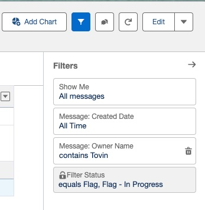

# Reports

There are multiple reports available for staff use in the mentoring program. Linked below are some of the more commonly used reports. The most common are the flagged message reports. You can find a Salesforce report folder with all of our [mentoring reports by clicking this link.](https://bestprep.lightning.force.com/lightning/r/Folder/00lRP000004l6VtYAI/view?queryScope=userFoldersCreatedByMe)

## Flagged Message Reports

When a message is submitted, it passes through our 

### [My Flagged Messages](https://bestprep.lightning.force.com/lightning/r/Report/00ORP000006JXsr2AG/view?queryScope=userFolders)

The "[My Flagged Messages](https://bestprep.lightning.force.com/lightning/r/Report/00ORP000006JXsr2AG/view?queryScope=userFolders)" report shows you all messages for active eMentors & Cloud Coach cases where you are the case owner. If you are looking for flagged messages for a particular user, you will click the filter icon (it looks like a funnel in the top right hand corner) 

{ style="display:flex;margin:auto;max-width:40%;border:1px solid #ccc;border-radius:8px;box-shadow:0 0 8px rgba(0,0,0,0.1);" }

### [All Flagged Messages](https://bestprep.lightning.force.com/lightning/r/Report/00ORP000006JYLt2AO/view?queryScope=userFolders)

If just seeing a single users flagged messages is not enough, or you want to check on all flagged messages in the system, you can do so with the report "[All Flagged Messages](https://bestprep.lightning.force.com/lightning/r/Report/00ORP000006JYLt2AO/view?queryScope=userFolders)." This contains all messages that are flagged for both Cloud Coach and eMentors in our Salesforce system for all time. This report should be entirely empty in the summer. 